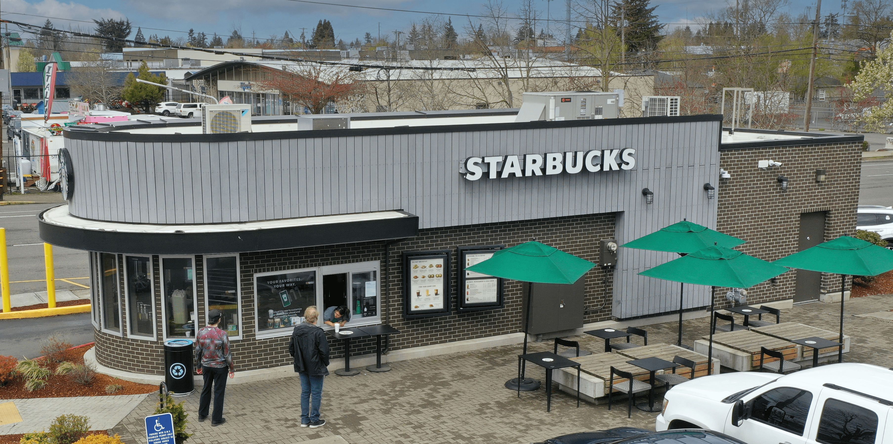

# Deal Stories



<figure><figcaption><p><a href="https://product.costar.com/detail/lookup/718997/public-record">CoStar</a></p></figcaption></figure>

***


11945 SW Pacific Hwy, Tigard, OR 97223

* RBA: `212,655`
* Land: `848,549 SF / 19.48 AC`
* Built / Renov: `1961 / 1985`


***

* **$13,650,000**
* In place cap rate of **6.7%**   |   `(with the Joanns vacancy)`
* Value add play is to capture NNNs that were not being charged, fill the big box and raise rents/fill other vacancies
* Management did a poor job on this & we found another $50,000 of income that wasn’t on the rent roll during the transaction



<figure><figcaption></figcaption></figure>

`10215 SE Stark St, Portland, OR 97216`

[`M-Net`](https://www.mymnet.com/activity/ZAE0100125) `|` [`CoStar`](https://product.costar.com/detail/lookup/7050189/summary)

***

* **$5,365,000**  |  10/15/2024
* 6.89% Cap
* 5.2 - Years Remain on Lease
* Year:  1988

***

* Top 5% Store Nationally – Starbucks Reporting Huge Sales and Paying Percentage Rent | Over 6.5 Years Remaining on Rare Absolute NNN Lease.
* Favorably Located in Portland’s Gateway Plan District – All Future Drive-Through Facilities are Prohibited Within the District.
* Starbucks has successfully occupied the building for over 16 years, has completed a remodel in 2020, and has over 6.5 years remaining on the lease. Starbucks is currently paying monthly percentage rent on substantial sales figures in addition to monthly fixed rent.



`5001-5099 River Rd N, Salem, OR 97303` - [CoStar](https://product.costar.com/detail/lookup/5919642/summary)

***

<figure><figcaption></figcaption></figure>

***

* **Price**: $13,750,000 - ($290.84/sf)
* **Cap**: 7.90%
* **RBA**: 47,277
* **Lot**: 314,939

***

[Keizer Plaza](https://product.costar.com/detail/all-properties/6797631/summary)

* **Buyer**: Amy Lin
* **RBA**: 16,871 SF
* **For-Sale**: $4,000,000 - ($358/sf)
* **Cap**: 7.00%



`1461-1661 N Highway 99 W, McMinnville, OR 97128`       -      [CoStar](https://product.costar.com/detail/all-properties/1149885/summary)

***

<figure><figcaption></figcaption></figure>

***

* **Price**: $5,820,000 - ($189.95/sf)
* **Cap**: 7.4%
* **RBA**: 30,640
* **Lot**: 119,790
* **Status**: Under Contract
* **Non-Credit Strip**

## EV Charging stations:

* $2-400 Per Month per stall
* 10-12 stalls
* [IONNA](https://www.ionna.com/)



<figure><figcaption><p><a href="https://product.costar.com/detail/lookup/7895785/summary">Tigard Liquor Store</a></p></figcaption></figure>

***

## Tigard Liquor Store

`12490 SW Main St, Portland, OR 97223`

***

* Sub-5 Cap  |  (4.78%)
* Sold to Tenant

***

* The owners hired us, knowing the Tenant wanted to buy this
  * We exceeded expectations
* $400,000 Higher than previous Valuation

***

```
Tigard Liquor Store closing
```




***



<figure><figcaption><p><a href="https://product.costar.com/detail/lookup/1163586/summary">CoStar</a></p></figcaption></figure>

***

**Bi-Mart Shopping Center**

`2206-2272 Santiam Hwy SE, Albany, OR 97322`

***

* Jan 15, 2025
* $12,200,000   |   ($181.94)
* Price/SF Land   |   ($12)

***

* 7 Properties
* 67,055 sf
* Land: 1,051,103 SF / 24.13 AC

***

[Lockehouse Retail Group](https://product.costar.com/detail/all-properties/6416146/sale)     Sold To     [The Elijah List](https://product.costar.com/detail/all-properties/6416146/sale) - _(Religious)_



[Ballad Towne Square](https://www.gerrity.co/properties/ballad-towne-square)

* and they just purchased Oswego Towne Square
* [Oswego Towne Square](https://product.costar.com/detail/sale-comps/default/Comp/7080222/summary/) | $49,000,000



<figure><figcaption><p>CoStar</p></figcaption></figure>

`2110-2175 W 6th Ave, Eugene, OR 97402`

Dec 30, 2024   |   **$5,235,000**   ($67.92)

* **10.13%** Cap

***

* Was on the market for roughly five months with an initial asking price of $7,100,000

```
https://ahprd1cdn.csgpimgs.com/d2/8anuCZzF0LLrRLuVIl1KP-_t4G1toioZYi5yJI7PMyU/Big%20Y%20OM%20-%202175%20W%207th%20Ave.pdf
```



<figure><figcaption><p><a href="https://product.costar.com/detail/lookup/8307259/summary">CoStar</a></p></figcaption></figure>

***

> **Jack in the Box**
>
> 2020 S Santiam Hwy, Lebanon, OR 97355

```
file:///C:/Users/Admin/Documents/Other/GRIST/Tenant's%20OCR/%F0%9F%8D%94%20Fast%20Food%20%F0%9F%8C%AE/Jack%20in%20the%20Box/(Jack%20in%20the%20Box)%202020%20S%20Santiam%20Hwy,%20Lebanon.pdf
```

***

* $2,380,000   |   4.75%
* Mar 3, 2025

***

* Absolute NNN Lease, Corporate-backed
* 17.5 years remaining
* New lease executed with the current operator **4/13/2022 - 4/30/2042**

***

```
file:///C:/Users/Admin/Documents/Other/GRIST/Tenant's%20OCR/%F0%9F%8D%94%20Fast%20Food%20%F0%9F%8C%AE/Jack%20in%20the%20Box/(Jack%20in%20the%20Box)%202020%20S%20Santiam%20Hwy,%20Lebanon%20(OLD).pdf
```

## Seller - [PREP Property Group](https://www.preppg.com/)

* _Originally Bought_ December of **`2020`**  for  **$1,600,000**
* (11/1/2011) - (10/31/2031)
* 12+ years left
* Tenant has a Right of First Refusal, & Sales Reporting

***

## Buyer - [FEAST Enterprises](https://www.instagram.com/feastenterprises/)

* FEAST Enterprises was formed in 2011 by partners David Beshay, Sam Fong, Lee Su, and Ben Eramya. During that span, FEAST has become one of the largest and fastest growing franchisee companies in the US




