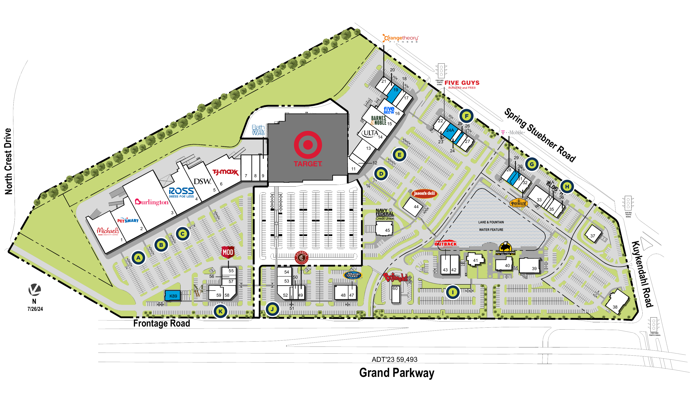

# 🏡 Listing Pages

<table data-view="cards"><thead><tr><th></th><th data-hidden data-card-cover data-type="files"></th><th data-hidden data-card-target data-type="content-ref"></th></tr></thead><tbody><tr><td><strong>Coldwell Banker</strong></td><td><a href="../../../.gitbook/assets/image (63).png">image (63).png</a></td><td><a href="https://www.cbcworldwide.com/properties/HYXHZH/1626-broadway-1628-broadway">https://www.cbcworldwide.com/properties/HYXHZH/1626-broadway-1628-broadway</a></td></tr><tr><td><strong>Washington Square II</strong></td><td><a href="../../../.gitbook/assets/image (69).png">image (69).png</a></td><td><a href="https://www.cbredealflow.com/handler/modern.aspx?pv=Z-I9J549zUFsSziezRAUlLxBjDNno8k6__qq94w7leTTpnHTuDlk4O3j4yuetLCk#_top">https://www.cbredealflow.com/handler/modern.aspx?pv=Z-I9J549zUFsSziezRAUlLxBjDNno8k6__qq94w7leTTpnHTuDlk4O3j4yuetLCk#_top</a></td></tr><tr><td><strong>Northmarq</strong></td><td><a href="../../../.gitbook/assets/image (70).png">image (70).png</a></td><td><a href="https://my.rcm1.com/buyer/slp?pv=elTFu6tRWb_qnkxL7R7YVZ3KYIiBOd6ichHhn_czUOD_82DR77gDOXwWv_xlhhte9HW_NBJUldtpNcdq3bTckg&#x26;internal_medium=link&#x26;internal_source=nm_web&#x26;internal_campaign=PropertySearchPage&#x26;internal_content=Link">https://my.rcm1.com/buyer/slp?pv=elTFu6tRWb_qnkxL7R7YVZ3KYIiBOd6ichHhn_czUOD_82DR77gDOXwWv_xlhhte9HW_NBJUldtpNcdq3bTckg&#x26;internal_medium=link&#x26;internal_source=nm_web&#x26;internal_campaign=PropertySearchPage&#x26;internal_content=Link</a></td></tr><tr><td><strong>JLL Investor Center</strong></td><td><a href="../../../.gitbook/assets/image (71).png">image (71).png</a></td><td><a href="https://invest.jll.com/us/en/listings/retail/starbucks-pascagoula-ms">https://invest.jll.com/us/en/listings/retail/starbucks-pascagoula-ms</a></td></tr><tr><td><strong>Commercial Integrity NW</strong></td><td><a href="../../../.gitbook/assets/image (72).png">image (72).png</a></td><td><a href="https://www.cinw.com/investment/prime205">https://www.cinw.com/investment/prime205</a></td></tr><tr><td><strong>Rogue Valley Mall</strong></td><td><a href="../../../.gitbook/assets/image (61).png">image (61).png</a></td><td><a href="https://spinosoreg.com/portfolios/rogue-valley-mall/">https://spinosoreg.com/portfolios/rogue-valley-mall/</a></td></tr><tr><td><strong>Wes Bochner</strong></td><td><a href="../../../.gitbook/assets/image (77).png">image (77).png</a></td><td><a href="https://www.nrpwest.com/properties/gatewaysc/">https://www.nrpwest.com/properties/gatewaysc/</a></td></tr><tr><td><strong>Perform Properties</strong></td><td><a href="../../../.gitbook/assets/image (43).png">image (43).png</a></td><td><a href="https://www.shopcore.com/property/puerta-real-plaza">https://www.shopcore.com/property/puerta-real-plaza</a></td></tr><tr><td>SitePlan</td><td><a href="../../../.gitbook/assets/image (62).png">image (62).png</a></td><td><a href="https://maps.kimcorealty.com/siteplan/building/114840/krc?uid=00008">https://maps.kimcorealty.com/siteplan/building/114840/krc?uid=00008</a></td></tr></tbody></table>

* Placer AI - Property Insights

<a href="https://www.crexi.com/properties/2011884/oregon-cypress-center">Crexi</a>

<figure><figcaption></figcaption></figure>


Notice how in property image gallery, the user is able to click a button for street view at the coordinates, and Map View

Also the name and quick details overlayed in the bottom left of the images


***

**Valuation Calculator**

<figure><figcaption></figcaption></figure>

***

**Demographic Insights** - (Graph/Table View)

<figure><figcaption></figcaption></figure> <figure><figcaption></figcaption></figure>

***


**Placer AI**


**Location Insights**

<figure><figcaption></figcaption></figure>

LoopNet

**Major Tenants / Rent Roll**

<figure><figcaption></figcaption></figure>

<figure><figcaption></figcaption></figure>

***

**Nearby Major Retailers**

<figure><figcaption></figcaption></figure>

***

**Transportation & Property Taxes**

<figure><figcaption></figcaption></figure>

<strong>Perform Properties</strong>

<figure><figcaption></figcaption></figure>

<figure><figcaption></figcaption></figure>

<figure><figcaption></figcaption></figure> <figure><figcaption></figcaption></figure>

<figure><figcaption></figcaption></figure>

***

### [Trade Area](https://www.kimcorealty.com/properties/canyon-ridge-plaza/114840/space/00008/view)

<figure><figcaption>
Trade Area Map <code>Trade area data by Placer.ai</code>
</figcaption></figure> <figure><figcaption>
Demographic Map <code>Demographic data by Block Group</code>
</figcaption></figure>

<figure><figcaption>
Demographics   |   <code>Popstats, 4Q 2024, Trade Area Systems</code>
</figcaption></figure>

**maps.propertycapsule.com**

Tenant Retailer Map   |   Renderings &#x26; Interactive

<figure><figcaption>
Google Earth Birds Eye Rendering - Tenant Map
</figcaption></figure>

<figure><figcaption></figcaption></figure> <figure><figcaption></figcaption></figure>

<figure><figcaption>
Floorplans
</figcaption></figure>

<figure><figcaption>
Historical Photos/Imagery
</figcaption></figure>

<figure><figcaption>
Historical Flyer / Marketing Packages
</figcaption></figure>

***

#### Browman Development



<figure><figcaption></figcaption></figure>



<figure><figcaption></figcaption></figure>



<figure><figcaption></figcaption></figure>



<figure><figcaption></figcaption></figure>



<figure><figcaption></figcaption></figure>



<figure><figcaption></figcaption></figure>



***

|              |                                                                                                                 |   |
| ------------ | --------------------------------------------------------------------------------------------------------------- | - |
| Trinity REIS | 
<figure><figcaption></figcaption></figure>
 |   |
|              |                                                                                                                 |   |
|              |                                                                                                                 |   |

