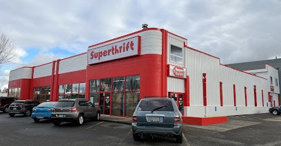
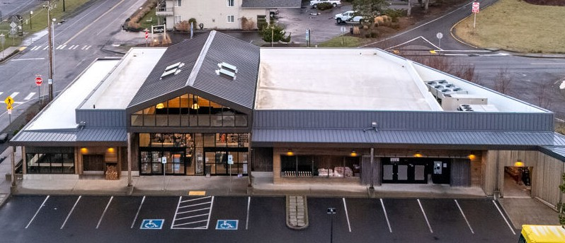
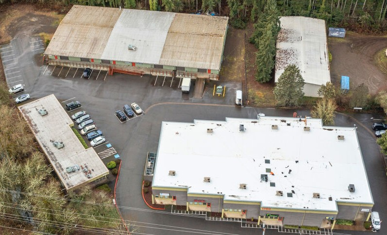

---
layout:
  width: default
  title:
    visible: true
  description:
    visible: false
  tableOfContents:
    visible: true
  outline:
    visible: true
  pagination:
    visible: true
  metadata:
    visible: true
  tags:
    visible: true
  actions:
    visible: true
  anchors:
    visible: true
---

# 💲 Listings


[notable-listings-other.md](../notable-listings-other.md)




<div><figure><figcaption><p><a href="https://www.nrpwest.com/properties/gatewaysc/">Listing Webpage</a></p></figcaption></figure> <figure><figcaption><p>Grocery-Anchored Power Center</p></figcaption></figure></div>

***

> <a href="file:///C:/Users/Admin/Documents/Other/GRIST/Tenant&#x27;s%20OCR/Centers-Plaza/Gateway%20Shopping%20Center/Gateway%20Shopping%20Center%20-%20Unlocked.pdf" class="button secondary">OM</a>   |  **Gateway Shopping Center**
>
> 9924 NE Halsey St, Portland, OR 97220

***

* Price  -  `$50,875,000`
* Excluding Kohl’s  -  `$44,875,000`  |  `7.25%`
* Occupancy  -  `96%`
* Size  -  `±368,299 SF`

***

**CBRE**

* The National Retail Partners – [West (NRP-West) team](https://www.retailipwest.com/)
* National Retail Partners - West [Listings](https://www.nrpwest.com/properties/)



<figure><figcaption><p>1710 W 6th St, The Dalles, OR 97058</p></figcaption></figure>

> **$560,000** in renovations:
>
> * Brand new roof
> * Full exterior rip out and fully redoing the parking lot
> * Brand new signage and everything, new LEDs

***

* Denny’s restaurants are open `365` days a year—even on Christmas Day and New Year's Day!
* `220+` Dedicated Franchisees
* `96%` Restaurants Franchised (`82` of which were company operated)

***

* From signing our first franchise agreement in `1963` to operating more than `1,600` restaurants, we have used our experiences to create America’s Diner

***

Partnering with sites like DoorDash, Denny's has launched two innovative virtual brands:&#x20;

* [The Meltdown](https://themeltdown.com/menu/)
* [The Burger Den](https://theburgerden.com/)

So, you can order a melt to fit your mood or a bold jolt of burger goodness anytime.

***



<figure><figcaption><p>SuperThrift - Salem</p></figcaption></figure>

> 3060 Portland Rd NE, Salem, OR 97301
>
> <a href="file:///C:/Users/Admin/Documents/2024/Garske%20OM/(Former%20Thrift%20Store)%203060%20Portland%20Rd%20NE,%20Salem.pdf" class="button secondary" data-icon="file-lines">OM</a>

***

| **Listing Price**                  | $1,200,000                 |
| ---------------------------------- | -------------------------- |
| **Price/SF**                       | $60.10                     |
| **RBA**                            | 19,968 SF                  |
| **Lot Size**                       | 1.47 Acres (64,033 SF)     |
| **Year Built**                     | 1942                       |
| **Assessor's Parcel Number (APN)** | R89685, 1189684            |
| **Zone**                           | IC (Industrial Commercial) |




***



<figure><figcaption></figcaption></figure>

> <a href="file:///C:/Users/Admin/Documents/2024/Proposals/Sue%20Brice/OM/OM%20-%20Woodburn%20Crossing%202024.pdf" class="button secondary">OM</a>
>
> `2213-2269 Country Club Rd, Woodburn, OR 97071`[   G-Sheet](https://docs.google.com/spreadsheets/d/1SGX16lRB0gSxjzn8f3mdIIqVYk3C8ziQ7sAkXYo8_UA/edit?gid=606681172#gid=606681172)

* Pricing: <mark style="color:green;">**$2,643,000**</mark> - (<mark style="color:green;">$94</mark>/SF)     |     ($2,293,000 After Credit)
* Cap: <mark style="color:green;">**6.94%**</mark>

***

* **RBA**: `27,565` SF
* **Lot**: `217,800` SF / `4.29` AC
* **Year**: `1978`

***

<mark style="background-color:green;">**Value-Add**</mark>

* **Average Rent/SF**: `$10.47`
* **Vacancies**: `2/18`
* **Leases**: `6 tenants are on Month-to-Month Leases`



<figure><figcaption><p><a href="https://www.crexi.com/properties/1824462/oregon-fresh-foods-marketplace-cannon-beach-oregon-absolute-nnn">Crexi</a></p></figcaption></figure>

***

> [**Fresh Foods**](https://apps.clatsopcounty.gov/property/property_details/?a=6975) **-** 15 years   |   <a href="file:///C:/Users/Admin/Documents/2024/Garske%20OM/(Fresh%20Foods)%203401%20S%20Hemlock%20St,%20Cannon%20Beach.pdf" class="button secondary">OM</a>\
> `3401 S Hemlock St, Cannon Beach, OR 97110`

***

* $6,461,000  -  ($625.28/sf)
* 6.50%
* **Year**: 2016
* **RBA**: 10,333 SF
* **Lot**: 0.56 AC

***

* Paying off construction and paying off debt, buying out partners
* High barriers of entry, another location Manzanita
* This is top performing location
* Took over for his dad and very optimistic to grow the business
* Cannon beach gets 750k annual visitors, this is the only grocery store



> **Corvallis Millrace Center**\
> 1750 SW 3rd St, Corvallis, OR 97333

<figure><figcaption><p><a href="https://product.costar.com/detail/lookup/5669312/summary">CoStar</a>   |   <a href="https://www.crexi.com/properties/1828313/oregon-corvallis-millrace-center">Crexi</a></p></figcaption></figure>

***

```
file:///C:/Users/Admin/Documents/2024/Garske%20OM/OM%20-%20Corvallis%20Millrace%20TGG.pdf
```

* $5,200,000   |   6.92%
* **RBA**: 41,478
* **Lot Size** (acres) 2.95

***


* **Diverse Income Stream**: Tenants include retail, office, and industrial uses, reducing reliance on any single sector.
* **Prime Location Near Oregon State University**
  * **OSU Proximity**: The center is minutes from **Oregon State University**, which has **37,000+ students and 9,000 faculty/staff**
  * **Growing Market**: Corvallis' **population is projected to reach 108,394 by 2028**

***

#### <mark style="background-color:blue;">**Recent Capital Improvement**</mark>

* **New Roofs**: Installed **in 2024 (Building 1750)**, with warranties on other roofs.
* **Upgraded Infrastructure**: **New parking lot, gas packs, and wireless fire suppression system**.
* **Flood Designation Removal in Progress**: Will reduce insurance costs.

***

#### <mark style="background-color:blue;">**Flexible Leasing & Value-Add Potential**</mark>

* **11 suites across 41,478 SF** provide flexibility for different tenant types
* **Room for Rental Growth**: Current rents are competitive but offer upside
* **Power Capacity for Industrial Use**: Building 1780 features **3-phase 480 amp power**

***

#### <mark style="background-color:blue;">**Strong Tenant Mix with Stability**</mark>

* **Institutional Anchor Tenant**: **Oregon State University leases over 14,000 SF** across two suites
* **Established Businesses**: Kohler Design, Ferrellgas, and VeoRide provide long-term stability
* **Long-Term Leases**: Multiple tenants are secured through **2027-2028**, minimizing turnover risk



<figure><figcaption><p><a href="https://product.costar.com/detail/all-properties/859496/summary">Fred Meyer Cornelius</a></p></figcaption></figure>

***

> **Fred Meyer** Cornelius
>
> `2200 Baseline St, Cornelius, OR 97113`

***


* $7,175,000
* CAP Rate 5.50%
* `609,840 SF | 14.00 Acres`

***

```
file:///C:/Users/Admin/Documents/Other/GRIST/Tenant's%20OCR/%F0%9F%93%A6%20Big%20Box%20%F0%9F%93%A6/(Fred%20Meyer%20-%20GL)%202200%20E%20Baseline%20St,%20Cornelius,%20OR%2097113.pdf
```





```
file:///C:/Users/Admin/Documents/Other/GRIST/Tenant's%20OCR/%F0%9F%8D%94%20Fast%20Food%20%F0%9F%8C%AE/(Cascade%20Station%20-%20Pad)%209687%20NE%20Cascades%20Pkwy,%20Portland.pdf
```

<figure><figcaption><p><a href="https://product.costar.com/detail/lookup/11175719/sale">CoStar</a>     |     <a href="https://www.crexi.com/properties/1877288/oregon-2-tenant-retail-pad-target-ikea-outparcel">Crexi</a></p></figcaption></figure>

***

> **Wendy's, Chipotle**
>
> `9687 NE Cascades Pkwy, Portland, OR 97220`

* $2,631,000
* 6.75%

***

* Chipotle  |  Exp - March 2029  |  2 (5-Year)
* Wendy's  |  Exp - October 2033  |  1 (5-Year)

***

* **Leasehold** (Building Ownership)
* **Location**: Strong Sales for both Chipotle & Wendy’s
* Opportunity to acquire the sub-leasehold interest in the land, subject to a ground lease with Target that runs through 2042.
* Situated at Cascade Station Pad in Portland, Oregon, a premier retail corridor and mixed-use destination.






> **Hobby Lobby** - [CoStar](https://product.costar.com/detail/for-sale/default/5283949/property)
>
> 1871 14th Ave SE, Albany, OR 97322

* $6,120,000 - _($99/sf)_ |    6.85%
* Lease Term  9+ Years     |     Exp  6/30/2034

***

> **Dollar Tree Center -** [CoStar](https://product.costar.com/detail/for-sale/default/5284128/property/)
>
> 1200 NW 6th St, Grants Pass, OR 97526

* $1,900,000 - _($115/sf)_   |     8.68%
* 5-year lease terms

***

* Both Dollar Tree and A-1 Market have recently extended their leases for another 5 years
* **Dollar Tree** has been operating at this location since 2001, demonstrating strong historical occupancy
* **A-1 Market** recently exercised into their first 5-year option at a rental rate 17% higher than their previous rate, with 2 more options to extend

***

[Account 6975](https://apps.clatsopcounty.gov/property/property_details/?a=6975)   |   [Little Sliver](https://apps.clatsopcounty.gov/property/property_details/?a=6972)

Personal Property Grocery Store  -  [Account 60655](https://apps.clatsopcounty.gov/property/property_details/?a=60655)



<figure><figcaption><p><a href="https://product.costar.com/detail/lookup/11572479/summary">Heritage Plaza</a></p></figcaption></figure>

***

<a href="file:///C:/Users/Admin/Downloads/Heritage%20Plaza.pdf" class="button secondary">OM</a>   |   `15650 NE Fourth Plain Blvd, Vancouver, WA 98682`

* Price: **$2,920,000**
* Cap Rate: **6.42%**
* **6** Tenants - All expire in **2028**

***

<table data-full-width="true"><thead><tr><th width="425">Tenant</th><th width="122">SF</th><th>Lease Exp</th></tr></thead><tbody><tr><td>Hundred Property Management</td><td>250</td><td>10/31/28</td></tr><tr><td>Weichert Realtors Equity NW</td><td>3,040</td><td>12/31/28</td></tr><tr><td>Security National Mortgage Company</td><td>200</td><td>12/31/28</td></tr><tr><td>Farmers Insurance</td><td>500</td><td>10/31/28</td></tr><tr><td>Business of Style Salon</td><td>500</td><td>11/30/28</td></tr><tr><td>Gambee Chiropractic</td><td>2,020</td><td>11/30/28</td></tr></tbody></table>

***

* Located on a signalized, hard-corner with excellent visibility and exposure to over 20,000 VPD on NE Fourth Plain Blvd.
* All of the tenants at the Property currently operate on NNN leases, allowing for reimbursement of nearly all expenses, including a management fee, and providing a hedge against rising operating expenses.
* The Property is 100% leased by a diverse mix of tenants including Weichert Realtors, a national real estate company, and Gambee Chiropractic, a chiropractic office, offering a stable and diversified income stream.



<figure><figcaption></figcaption></figure>

```
file:///C:/Users/Admin/Documents/2024/Garske%20OM/OM%20-%20NWRA%20Medical%20Center%20TGG.pdf
```

`1025 2nd St NW, Salem, OR 97304`     |    [CoStar](https://product.costar.com/detail/lookup/12354751/summary)

* Pricing: <mark style="color:green;">**$5,500,000**</mark> - (<mark style="color:green;">$94</mark>/SF)
* Cap: <mark style="color:green;">**6.20%**</mark>

***

* **RBA**: `10,800` SF
* **Lot**: `28,114` SF / `0.65` AC

***

* Therapy Partners Group   `11/01/2027`
* Dr. Marc Braman   `09/31/2025`
* Erin Sudduth   `MTM`



`1461-1661 N Highway 99 W, McMinnville, OR 97128` - [CoStar](https://product.costar.com/detail/all-properties/1149885/summary)

***

<figure><figcaption></figcaption></figure>

***


* **Price**: $5,950,000 - ($194.19/sf)
* **Cap**: 7.26%
* **RBA**: 30,640
* **Lot**: 119,790
* **Status**: Under Contract

***

## EV Charging stations:

* $2-400 Per Month per stall
* 10-12 stalls
* [IONNA](https://www.ionna.com/)




<details>

<summary>Chick-fil-A Woodburn</summary>

`300 South Woodland Ave, Woodburn, OR 97071`

* [Building permit](https://www.woodburn-or.gov/sites/default/files/fileattachments/community_dev._planning/project/16598/memo_2024-05-30_bp_971-23-000849-str_chick-fil-a_planning_div_review_fin.pdf)
* [Design Review](https://www.woodburn-or.gov/dev-planning/project/design-review-dr-22-26-chick-fil-300-s-woodland-ave)
  * `Develop the empty property of approximately 1.39 acres at the southeast corner of OR Highway 219 & Woodland Avenue into a Chick-fil-A fast food restaurant of 2,872 square feet (sq ft) with a drive-through with double lanes, no indoor dining area, and a walk-up order window.`
* The “[final decision](https://www.woodburn-or.gov/sites/default/files/fileattachments/community_dev._planning/project/16598/final_decision_dr_22-26_v15_fin_b_w_attachs.pdf)” document with the conditions of approval remains on the [City project webpage](https://www.woodburn-or.gov/dev-planning/project/design-review-dr-22-26-chick-fil-300-s-woodland-ave) or via the City Projects webpage at
* [Building permit 971-23-000849-STR Chick-fil-A Planning final inspection comments (November 19, 2024)](https://www.woodburn-or.gov/sites/default/files/fileattachments/community_dev._planning/project/16598/memo_2024-11-19_chick-fil-a_planning_site_inspection_result.pdf)&#x20;


</details>


***

