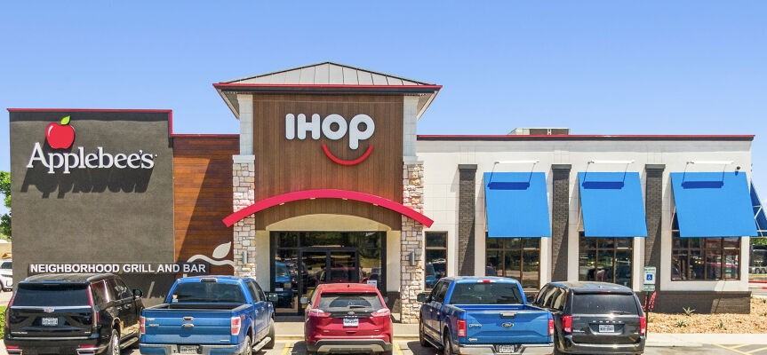
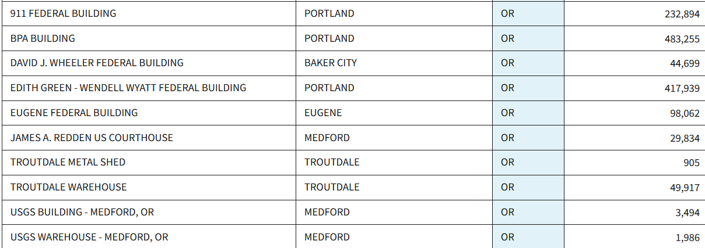

---
layout:
  width: default
  title:
    visible: true
  description:
    visible: false
  tableOfContents:
    visible: true
  outline:
    visible: false
  pagination:
    visible: true
  metadata:
    visible: true
  tags:
    visible: true
  actions:
    visible: true
  anchors:
    visible: true
---

# ☎️ News & Notable

***



<figure><figcaption><p><a href="https://product.costar.com/detail/lookup/858525/summary">CoStar</a><br><code>5415 SW Beaverton Hwy, Portland, OR 97221</code></p></figcaption></figure>

***

```
Albertsons on Beaverton-Hillsdale closing
```

Intersection of **Shattuck** & **Beaverton-Hillsdale**


Announced plans to close its **Baker City Safeway**. Expected to close May 25th, 2025. \
"Like all retailers, we are constantly evaluating the performance of our stores."


***

[PBJ](https://www.bizjournals.com/portland/news/2025/04/30/albertsons-to-close-southwest-portland-location.html)

* According to Albertsons Cos. spokesperson Jill McGinnis, the Albertsons location at 5415 SW Beaverton-Hillsdale Highway will close “on or before July 1.”
* Albertsons has leased the space since 1960, but couldn't come to a lease agreement with the landlord, McGinnis said.

***

[Portland Maps](https://www.portlandmaps.com/detail/permit/2024-099826-000-00-EA/5104127_did/)

* A new 10,000 sf one story retail building is proposed at SE corner of the site, adjacent to both street lot lines. The existing 37,000 sf grocery store will be demised into two or three tenant spaces with new facade treatment.

***

`Benenson Capital - Albertsons`



<figure><figcaption><p><a href="https://www.chron.com/news/article/texas-3d-starbucks-brownsville-20287125.php">Article</a>  -  <a href="https://www.entrepreneur.com/business-news/starbucks-is-opening-a-store-in-texas-made-with-a-3d-printer/490426">2</a>  -  <a href="https://www.designboom.com/architecture/3d-printed-starbucks-texas-brownsville-peri-04-23-2025/">3</a></p></figcaption></figure>

> 2491 Boca Chica Blvd, Brownsville, TX 78521
>
> _Approximately 20 miles from SpaceX's Starbase launch site_

***

* Designed specifically for drive-thru & mobile order pick-ups, with no indoor seating areas
* **Reduced Construction Time**
* **Cost Efficiency** - Can save 30-50% in construction costs
* **Design Flexibility** - Greater design flexibility and precision in construction
* **Sustainability Benefits** - Decreased material waste & potentially lower carbon emissions

`Opens April, 2025 - Brownsville, Texas`

***

Starbucks partnered with PERI 3D Construction to reduce time and cost in creating the 1,400-square-foot structure.

* Built with layers of concrete piped out by a giant robotic printer
* Part of the company’s ongoing effort to modernize operations & trim costs
* Peri-3D, a German company, used a giant 3D printer to `pump out layers of concrete mixture to create the structure`
* According to [the Texas Department of Licensing and Regulation,](https://www.tdlr.texas.gov/TABS/Search/Project/TABS2024006040) the cost for building the small scale coffee shop was about $1.2 million.

***

The accounting platform Freshbooks says [building a restaurant](https://www.freshbooks.com/hub/estimates/how-much-does-it-cost-to-build-a-restaurant) from the ground up can cost up to $2 million. However, a smaller-scale quick-serve restaurant may cost less to build. According to [KRG Hospitality](https://krghospitality.com/2025/01/24/bars-and-restaurants-how-much-to-open/), it costs around $535 per square foot to build a quick serve restaurant, which comes out to $749,000 for a 1,400-square-foot structure like the new Starbucks—a bit less than the $1.2 price tag for the 3D-printed build.



> **Applebee's & IHOP** Dual Brand Restaurant
>
> 250 NE Agness Ave, Grants Pass, OR 97526

<figure><figcaption><p><a href="https://www.crexi.com/properties/1899454/oregon-applebees-ihop-dual-brand-restaurant">Crexi</a></p></figcaption></figure>

***

* <mark style="color:green;">$4,835,000</mark>   |   6.35%
* 4,964 SF
* Originally listed for $2,650,000
* Sold on Mar 30, 2025  -  <mark style="color:green;">$1,603,585</mark> `($324.22/SF)`

***

* Full remodel into a next-gen Applebee’s + IHOP dual-brand prototype, secured by a 20-year absolute NNN lease
* Long Operating History with Extensive Remodel
* Strategic I-5 Location Within Proximity to Demand Generators



#### Red Robin Is Now The Latest Restaurant Chain To Make The Move To Shutter Underperforming Locations To Deal With Losses And Financial Difficulties

Red Robin Has 498 Restaurants in North America.

[https://kw3.com/red-robin-closing-locations/](https://kw3.com/red-robin-closing-locations/)

\
Weighing plans to potentially close 70 locations once their leases expire as it attempts to turn around its operations. The company closed one location in the fourth quarter of the fiscal year 2024 and recorded a loss of $32.4 million, mainly from the "review of underperforming restaurants."

***

[Fox Biz](https://www.foxbusiness.com/lifestyle/red-robin-considers-closing-70-locations-amid-financial-woes)

***

Insights<br>

* If you think back a little, you'll probably recall very clearly how **Red Lobster, TGI Fridays, Denny's, Ruby Tuesday, California Pizza Kitchen, Chuck E. Cheese**, and others filed for bankruptcy protection and began closing what they called "under-performing" locations to keep the company afloat
*   Other chains, such as **Wendy's, Burger King, and Outback Steakhouse**, have not filed for bankruptcy protection but have closed locations to lower their footprint and increase their chances of survival.


***



> [Gresham Planning](https://www.greshamoregon.gov/globalassets/city-departments/urban-design-and-planning/projects/active-planning-projects.pdf)

***

## **In-N-Out**

`1979 NE Burnside Rd, Gresham, OR 97030`

Oregon Trail Shopping Center (Former Shari's)

***

<figure><figcaption><p><a href="https://www.koin.com/local/multnomah-county/in-n-out-enters-early-planning-stages-for-gresham-drive-thru-in-former-sharis-space/">City of Gresham</a></p></figcaption></figure>

***

* Pre-Application
* In-N-Out would take over the Shari’s space - (demolition of the pre-existing building, as well as another 9,600 square feet of space in the Center)
* Construction crews would then build a new, 3,886-square-foot restaurant and a 1,123-square foot area for outdoor seating. The drive-thru line would additionally require enough space for 37 vehicles.

***

**Development Features:**

* Demolition of the existing 3,825
  &#x20;square foot Shari's Cafe
* Construction of a new 3,886 sqft
  &#x20;quick service restaurant
* Demolition of 9,600 square feet of
  &#x20;the existing multi-tenant
* Construction of a 37-vehicle queue
  &#x20;drive-thru
* Construction of a 1,123 square foot
  &#x20;outdoor seating area
* Reduction in the total number of parking spaces from 129 stalls to 95
  &#x20;stalls
* Installation of four (4) short-term
  &#x20;bicycle parking spaces

***

## **McDonald’s**

`1275 Kane Dr, Gresham, OR 97080`

***

* Awaiting Pre-Application
* Date Filed: 02/18/2025
* New construction of a McDonald’s
  &#x20;restaurant with drive-thru

***




***

## 2025



## [Portland](https://bikeportland.org/2024/01/03/portland-parks-will-invest-15-million-to-fully-fund-the-steel-bridge-skatepark-382865) Parks will invest $15 million to fully fund the Steel Bridge Skatepark <a href="#post-title-t3_18xr9ep" id="post-title-t3_18xr9ep"></a>

[Steel Bridge Skatepark Development Plan](https://www.daoarchitecture.com/projects/steelbridge-skatepark-development-plan)

.png>).png>)

A rendering of the proposed skatepark near Steel Bridge in Portland's Old Town neighborhood.

Right next to - `123 NW Flanders St, Portland, OR 97209`

***

[KGW](https://www.kgw.com/article/news/local/portland-odot-land-swap-deal-steel-bridge-skatepark/283-aecb1ff3-1a97-45de-94e2-92d242368fd4)     |     [Skaters For Portland Skateparks](https://www.skateportland.net/steel-bridge-skatepark)     |     [A New Look at the Skate Plaza](https://www.skateboarding.com/trending-news/a-new-look-at-portlands-projected-15m-skate-plaza)

***

* The planned Steel Bridge skatepark is moving one step closer to reality with the development of a land swap deal that will give the city of Portland full ownership of the planned 30,000-square-foot park site in Old Town.
* The idea of a skatepark at the site has been [on the city's books](https://www.portland.gov/parks/documents/skatepark-system-plan-2008/download) since 2008 and drawn consistent support from advocates like the Steel Bridge Skatepark Coalition, Prosper Portland and the organization Skate Like a Girl, but progress was slow until a [breakthrough](https://www.kgw.com/article/news/local/portland-parks-funds-steel-bridge-skatepark-old-town-neighborhood/283-1ca1122c-8c9a-4b28-8345-db10b668f2f1) last year when Portland Parks & Recreation set aside $15 million, enough to fully fund development.&#x20;



<figure><figcaption><p><a href="https://cedarmillnews.com/article/0225-development-news-february-2025/">Macy’s closing, zoning changing</a></p></figcaption></figure>

***

* The Macy’s store in the Streets of Tanasbourne is closing soon, although we don’t have a date.&#x20;
* Owners of the property are asking Hillsboro planners to approve a [zone change to allow mixed use ](https://hillsboro-oregon.civicweb.net/document/244817/Staff%20Report%20and%20Attachments.pdf?handle=332B754FE30342C48AB654D6AD60C597)of three lots (17.6 acres) to allow a combination of housing and retail.&#x20;
* This includes the Macy’s building along with several other retail buildings & associated parking.&#x20;
* It’s still unclear if any of the buildings will remain and be repurposed or if it will all be rebuilt.



**Lamborghini Dealership**\
`25239 SW Parkway Ave, Wilsonville, OR 97070`

***

<figure><figcaption><p><a href="https://www.wilsonvillespokesman.com/news/local/continuing-the-family-business-new-lamborghini-dealership-will-open-in-wilsonville/article_ae9a6f98-486b-11ef-8452-f7c138b3f2f9.html">Article</a>     |     <a href="https://www.ci.wilsonville.or.us/engineering/project/lamborghini-dealership">Development Proposal</a></p></figcaption></figure>

***

**Owner**:  Bradley Tonkin (Casa Tonchinni LLC)

**RBA**:  37,508 sf

***

<mark style="color:green;">Construction is expected to be completed mid-2026, said Celia Tonkin</mark>

```
file:///C:/Users/Admin/Downloads/Lamborghini%20Dealership.pdf
```

***

The Tonkin family has sold cars in the Portland area since 1966, starting with the Ron Tonkin Gran Turismo dealership that now resides in Wilsonville and is the oldest Ferrari dealership in North America, according to the company’s website. Now, Celia Tonkin and her brother, Brendan, are continuing the family business with a new Lamborghini dealership in Wilsonville.

With construction estimated to finish in mid-2026 — up the street from the Ron Tonkin Gran Turismo dealership.&#x20;

Currently, the closest Lamborghini dealerships to Portland are in Bellevue, Washington and San Francisco, California



<figure><figcaption><p><a href="https://www.reddit.com/r/Eugene/comments/1j3qbvs/doge_is_selling_the_eugene_federal_building_they/?rdt=42177">Reddit</a>   |   <a href="https://www.bizjournals.com/portland/news/2025/03/04/feds-to-sell-downtown-portland-buildings.html">PBJ</a>   |   <a href="https://www.opb.org/article/2025/03/04/oregon-federal-buildings-going-up-for-sale-according-to-government-list/">OPB</a></p></figcaption></figure>

***

Oregon federal buildings going up for sale, according to government list

_Editor’s note: This story has been updated to note that, after this report was published, the U.S. General Services Administration removed from its website a list of buildings for sale across the United States, including in Oregon._

***

The Trump administration has said it intends to put 10 federal buildings up for sale in Oregon, according to the U.S. General Services Administration. They’re among hundreds of federal properties across the country “designated for disposal” in a list published Tuesday.

The potential sales come as the Department of Government Efficiency, an office created by President Donald Trump with billionaire Elon Musk, has vowed to slash spending across the federal government. Thousands of federal workers have been fired in the process.

***

**The buildings that were listed as for sale in Oregon are:**

* David J Wheeler Federal Building, Baker City
* Eugene Federal Building, Eugene
* James A. Redden U.S. Courthouse, Medford
* USGS Building, Medford
* USGS Warehouse, Medford
* 911 Federal Building, Portland
* BPA Building, Portland
* Edith Green-Wendell Wyatt Federal Building, Portland
* Troutdale Metal Shed, Troutdale
* Troutdale Warehouse, Troutdale

In Southwest Washington, the Vancouver Federal Building was also marked for possible sale, according to the GSA records.



<figure><figcaption><p>Announced store closures more than doubled in 2024</p></figcaption></figure>

***

<figure><figcaption><p>Every closure has a story, many have two…</p></figcaption></figure>



***


[cedar-hills-shopping-center.md](cedar-hills-shopping-center.md)

