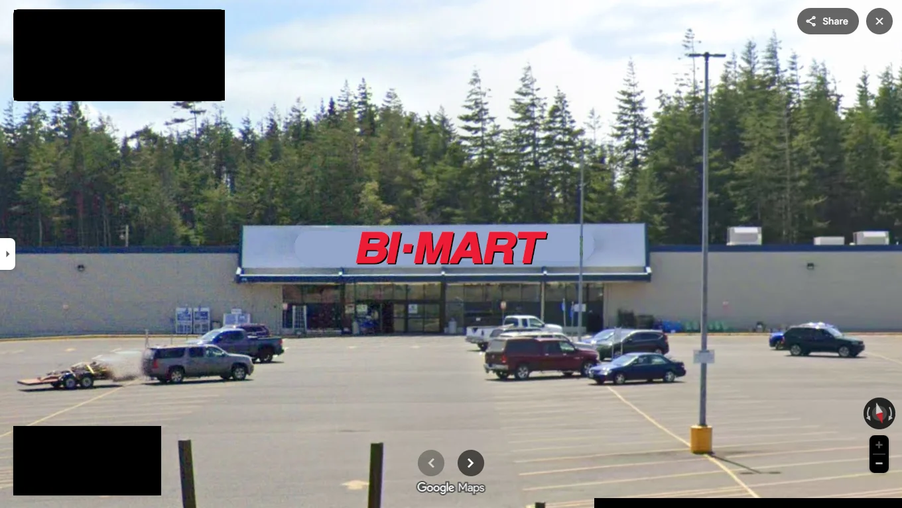

# Cascade Farm and Outdoor

Bi-Mart Seaside

After Hood River, they will be opening a new Bi-Mart in Seaside later this year

[https://capitalpress.com/2026/01/29/bi-mart-to-shutter-cascade-farm-and-outdoor-stores/](https://capitalpress.com/2026/01/29/bi-mart-to-shutter-cascade-farm-and-outdoor-stores/)

[https://www.reddit.com/r/oregon/comments/1r9t2px/fourfive\_different\_companies\_to\_replace\_bimarts/](https://www.reddit.com/r/oregon/comments/1r9t2px/fourfive_different_companies_to_replace_bimarts/)



> One of the Cascade locations, in Keizer, Ore., will be taken over by Wilco, a farmer-owned cooperative based in Mt. Angel, Ore., which continues to expand.
>
> After a Wilco opening in Aloha, Ore., in early April, the Keizer, Ore., location will become Wilco’s 28th store. A larger grand opening is planned for that location in spring 2027.
>
> About a decade ago, Wilco had 15 stores in Oregon, Washington and California.
>
> “The decision, while difficult, is strategically important as Bi-Mart’s employee owners move to further strengthen our solid financial position and focus on our plans for future growth in the Northwest,” stated a Bi-Mart news release.



***

Four/Five Different Companies to Replace Cascade Farm and Outdoor

<figure><figcaption>
Bi-Mart (Coos Bay)
</figcaption></figure>

<figure><figcaption>
Wilco Farm Stores (Keizer)
</figcaption></figure>

<figure><figcaption>
John's Incredible Pizza Company (Springfield)
</figcaption></figure>

