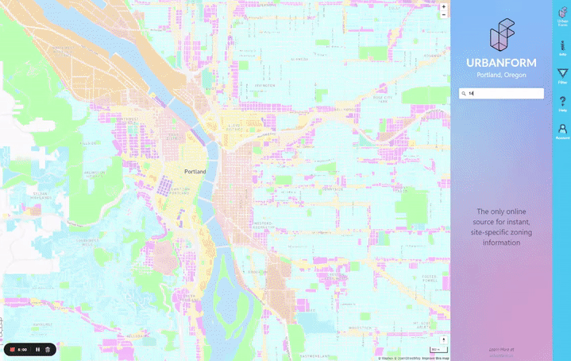

---
layout:
  width: default
  title:
    visible: true
  description:
    visible: false
  tableOfContents:
    visible: true
  outline:
    visible: false
  pagination:
    visible: true
  metadata:
    visible: true
  tags:
    visible: true
  actions:
    visible: true
  anchors:
    visible: true
---

# 🏗️ Cedar Hills Shopping Center

Sale Information

***

`10106-10280 SW Park Way, Portland, OR 97225`&#x20;

[CoStar - 1](https://product.costar.com/detail/all-properties/7231730/contacts)  |  [CoStar - 2](https://product.costar.com/detail/all-properties/718948/contacts)  |  [CoStar - 3](https://product.costar.com/detail/lookup/6530071/shopping-center)

***

* **Sale Date**: Oct 31, 2024
* **Sale Price**: $18,000,000
* **Price/SF**: $151.45
* **RBA**: 144,359 SF
* **Land**: 598,262 SF / 13.73 AC

***

* Redevelopment Project > 6 Stories apartments
* **Beaverton DMV & Harbor Freight** - `Not being redeveloped`
  * `"encumbered by leases" (lease terms were too long to wait)`

***

* **Buyer**: [Trammell Crow Company](https://www.trammellcrow.com/)
  * `Trammell Crow Company is a global real estate development firm. It has been a subsidiary of CBRE Group since 2006`
* **Seller**: CHSC Management - `Gary Ruchaber` (Cashed out)

***

## Cedar Mill News

<figure><figcaption>
<a href="https://cedarmillnews.com/article/0225-development-news-february-2025/">Cedar Hills Apartments</a>
</figcaption></figure>

***

**No changes to the design are expected:**

* 4700 SF ground floor commercial space
* 400 attached dwelling units
* The existing building housing the DMV and Harbor Freight will remain unchanged.

***

## Latest Update

`February 3, 2025`

* The developer got a two-year extension on Beaverton’s approval last summer
* Damin Tarlow of [High Street Residential ](https://www.highstreetresidential.com/)suggested we check back around August
* The east side of the mall will be demolished and replaced with mixed use residential and commercial while Harbor Freight and the DMV will remain

***

## Development Play - 2025

[For-Sale](https://www.crexi.com/properties/1918042/oregon-sunset-stand-alone):

> [**Sunset Stand Alone**](https://www.barnardcommercial.com/sunset-restaurant.html)
>
> 10205 SW Park Way, Portland, OR 97225

* $2,200,000
* 4,000 SF
* .67 Acre Lot   |   29,185 SF

Mexican Restaurant (pollos aguilar taqueria)

***

## Urban Form Development Co

<figure><figcaption>
<a href="https://www.oregonlive.com/galleries/6QAGGKVNVREWTBSTYFBXI6B2CY/">OregonLive</a>
</figcaption></figure> <figure><figcaption></figcaption></figure> <figure><figcaption></figcaption></figure>

> A drawing of how the redevelopment of the Cedar Hills Shopping Center would look with six 6-story buildings with a total of 509 apartments, plus
> &#x20;56,388 square feet of retail space on ground floors of two of the buildings. The Beaverton Planning Commission approved the plan, but the City Council still has to clear two changes in the city development code.
>

<a href="https://pdx.urbanform.us/" class="button secondary">UrbanForm - Portland</a>    &#x20;

<figure><figcaption>
<a href="https://pdx.urbanform.us/">Portland Region Zoning Map | UrbanForm</a>
</figcaption></figure>

UrbanForm is zoning de-coded.

> UrbanForm serves zoning and building information to architects, real estate developers, and municipalities.

<figure><figcaption></figcaption></figure>

* Uses AI to apply and display only the relevant regulations
* Instant Detailed Reports
* Easy online map interface

<a href="https://pdx.urbanform.us/" class="button secondary">Portland &#x26; Beaverton</a>   |   <a href="https://sea.urbanform.us/" class="button primary">Seattle &#x26; Bellevue</a>   |   <a href="https://san.urbanform.us/" class="button secondary">San Diego, CA</a>&#x20;

<a href="https://aus.urbanform.us/" class="button primary">Austin, TX</a>   |   <a href="https://la.urbanform.us/" class="button secondary">Los Angeles</a>   |   <a href="https://yam.urbanform.us/" class="button primary">Yamhill</a>





***

## Yamhill

Though a first-of-its-kind partnership between private, public, and non-profit sectors, UrbanForm Yamhill is now live and COMPLETELY FREE and open-access for all. [Visit UrbanForm Yamhill here](https://yam.urbanform.us/).&#x20;



The MMHF, SEDCOR, and UrbanForm have teamed up with the leadership of jurisdictions in Yamhill County to digitize 41,500 parcels of land to advance the zoning and permitting process. The initiative will empower the County’s cities – like Newberg, Dayton, and Lafayette – with an easy-to-use tool that streamlines access to jurisdictional zoning codes, improves permit application quality, and saves time for applicants and reviewers.

The work is anticipated to add capacity to municipal staff and reduce the time to develop critically needed housing in the region. The project was partially funded by an investment from the Workforce Housing Investment Fund (WHIF), established by SEDCOR and managed by the MMHF, to invest in innovations that address the workforce housing needs of Newberg, OR employers.

UrbanForm was built by architects, engineers, and planners to provide instant, easy access to what was one of the most complex, confusing, and inaccessible aspects of building design and development—the zoning.

Merging data from across multiple types of media, from various sources, calculating formulas, and locating site specifics automatically, UrbanForm can get everyone on the same page faster.&#x20;
