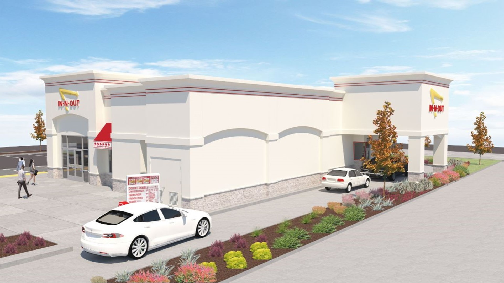
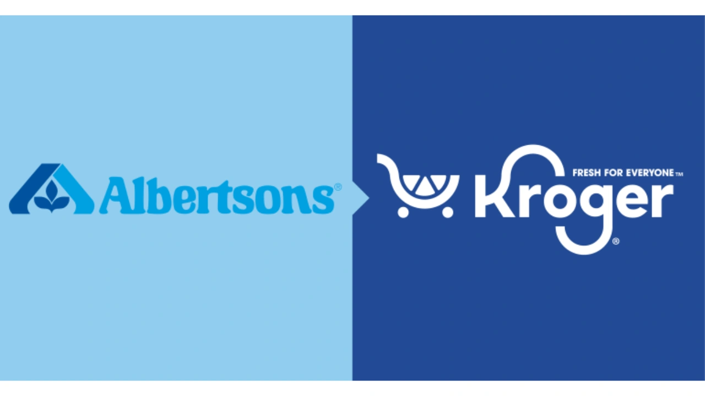

---
layout:
  width: default
  title:
    visible: true
  description:
    visible: false
  tableOfContents:
    visible: true
  outline:
    visible: true
  pagination:
    visible: true
  metadata:
    visible: true
  tags:
    visible: true
  actions:
    visible: true
  anchors:
    visible: true
---

# October - December '24

## **Older**



<figure><figcaption><p><a href="https://www.kgw.com/article/news/local/in-n-out-eyes-beaverton-location/283-69c7dfea-9804-43ee-851e-f5ac950e2f58">Renderings of possible In-N-Out location at 10565 SW Beaverton Hillsdale Hwy in Beaverton</a></p></figcaption></figure>

***

## New Locations - Developments

1. [**Beaverton**](https://www.washingtoncountyor.gov/current-planning/frequently-discussed-development-applications#L2200066)  -  `10565 SW Beaverton Hillsdale Hwy, Beaverton, OR 97005`
   1. 3,885 SF w drive-thru & outdoor seating
   2. First reviewed the In-N-Out proposal in June 2022 and denied it that August, [finding it hadn't met all the needed land-use requirements](https://www.bizjournals.com/portland/news/2022/08/31/portland-in-n-out-burger.html)
   3. Neighbors [have also voiced concerns](https://www.bizjournals.com/portland/news/2021/03/25/in-n-out-burger-update-beaverton-hillsdale.html) about [backups and traffic](https://www.bizjournals.com/portland/news/2022/08/31/portland-in-n-out-burger.html) that could stem from the proposed location
   4. "Once we break ground on a new location, it usually takes us **eight to nine months** to build and open a restaurant for business"
2. **Portland**  -  `11270 NE Holman St, Portland, OR 97220`

***

[In-N-Out Burger won a big approval for a new restaurant near Beaverton](https://www.bizjournals.com/portland/news/2024/04/18/washington-county-eases-way-for-in-n-out-burger.html)

* The location has been contentious due to traffic concerns
* The California company has been interested in the highway [location since at least 2020](https://www.bizjournals.com/portland/news/2020/10/19/in-n-out-burger-scoped-out-beaverton-hillsdale-hwy.html), [but its application has been heavily contested](https://www.bizjournals.com/portland/news/2024/04/10/washington-county-awaits-in-n-out-decision.html), including going to the Oregon Land Use Board of Appeals, which sent it back to the county for another look.



## Clackamas Town Center Mall Faces Financial Strain 🏢💸

* The mall was built in **1981**
* It was [last purchased in 2002 by a joint venture](https://www.bizjournals.com/portland/stories/2002/08/26/daily20.html) between the Teachers’ Retirement System of the State of Illinois and General Growth Properties Inc. called GGP-TRS LLC, for $634 million
* **Last appraised at $342 million in 2022**, down 7.5% from its $370 million valuation in 2012
* General Growth Properties, Inc., [was acquired in 2018 by Brookfield Property Partners L.P.,](https://bpy.brookfield.com/press-releases/bpy/brookfield-property-partners-lp-completes-acquisition-ggp-inc) which currently manages the real estate of the property.
* Like other shopping centers across the country, Clackamas Town Center [underwent a large renovation](https://www.bizjournals.com/portland/stories/2007/05/14/story10.html) in 2007 that added 250,000 square feet to accommodate around 40 new retailers, a 20-screen movie theater and redone food court.

Clackamas Town Center mall in Happy Valley, Oregon, is grappling with a $191 million mortgage default, adding to the woes of American malls struggling with changing consumer habits and declining retail space.



<figure><figcaption></figcaption></figure>

## [Federal judge blocks $25B Kroger-Albertsons merger, but leaves door open for future deal](https://thehill.com/business/5033124-federal-judge-blocks-kroger-albertsons-merger/)

* **Antitrust Enforcement:** The ruling underscores the government's commitment to preventing monopolies and protecting competition.
* **Consumer Impact:** The decision aims to safeguard consumers from potential price increases and reduced choices due to fewer competitors.
* **Grocery Industry Restructuring:** The failed merger could prompt alternative strategies for grocery retailers, including partnerships or acquisitions of smaller chains.

**Main Insights:**

* 🚫 **Blocked Merger:** A judge ruled against the mega-merger, blocking Kroger from acquiring Albertsons.
* 🛡️ **Antitrust Concerns:** The judge cited potential harm to competition and consumer prices as reasons for the decision.
* 🍎 **Grocery Giant Fallout:** The move raises questions about the future of the grocery industry and its consolidation.
* 💰 **Financial Impact:** Kroger faces significant financial repercussions, as the deal was expected to bring substantial cost savings and market dominance.

**Key Talking Points: 📈📉**

A federal judge has put the brakes on Kroger and Albertsons' proposed $24.6 billion merger, citing antitrust concerns.

***

## [Albertsons Backs Out of Merger Deal & Sues Kroger After Court Rulings](https://www.nytimes.com/2024/12/11/business/albertsons-kroger-merger-deal.html) <a href="#link-18a8ed49" id="link-18a8ed49"></a>

Albertsons said it had filed a lawsuit against Kroger, seeking a $600 million termination fee as well as billions of dollars in [legal fees](https://apnews.com/article/kroger-albertsons-merger-ftc-antitrust-3ba6eba066636626c4bdc6cd4f73fa29) and lost shareholder value. Kroger said the claims were “baseless” and that Albertsons was not entitled to the fee.


[ABC](https://abcnews.go.com/US/wireStory/albertsons-kroger-merger-sues-grocery-chain-failing-secure-116676192)   |   [The Hill](https://thehill.com/business/5033124-federal-judge-blocks-kroger-albertsons-merger/)   |   [CNN](https://www.cnn.com/2024/12/11/business/albertsons-calls-off-merger-sues-kroger/index.html)   |   [The NYT](https://www.nytimes.com/2024/12/11/business/albertsons-kroger-merger-deal.html)<br>



<figure><figcaption></figcaption></figure>

```
file:///C:/Users/Admin/Documents/Other/GRIST/Tenant's%20OCR/(Kura%20Sushi)%203321%20184th%20St%20SW,%20Lynnwood,%20WA.pdf
```

***

## [Kura Sushi](https://kurasushi.com/locations)

`3321 184th St SW, Lynnwood, WA 98037`      [Crexi](https://www.crexi.com/properties/1736350/washington-kura-sushi)      |      [CoStar](https://product.costar.com/detail/lookup/6995743/sale)

* <mark style="background-color:green;">**$6,950,000**</mark>    |   <mark style="background-color:green;">**4.70%**</mark>
* **NOI**: $325,805
* **RBA**: 3,833

***

## Former Sale:

* $3,600,000
* Nov 15, 2024
* **Buyer**: `Madison Real Property LLC`
* **Former Tenant**: `JP Morgan & Chase Bank`

***

## Investment Highlights:

◊ **New 15-year Absolute Net Lease**&#x20;

&#x20;         »`Kura Sushi signed a new 15-year lease w/ zero Landlord obligations`

◊ **Newly Renovated**/**Tenant Capital Commitment**&#x20;

&#x20;         » `Making a large capital investment to fully renovate the building`

◊ **Contracted Rental Increases**&#x20;

&#x20;         » `Kura Sushi’s lease contains 10% increases every five years`



<figure><figcaption></figcaption></figure>

[Excess Properties](https://www.mcdonalds.com/content/dam/sites/usa/nfl/pdfs/EXCESS-WEBSITE-LIST-OWN-LEASE.pdf)

Available Excess Properties:\
&#x20;   •    `18550 Willamette Dr, West Linn, OR 97068`  |  [CoStar](https://product.costar.com/detail/all-properties/9208057/summary)

&#x20;   •    `325 Torbett, Richland, WA 99354`  |  [CoStar](https://product.costar.com/detail/lookup/8998372/summary)

&#x20;   •    `Sites identified as “owned” may sometimes be only considered for lease, not for sale`

&#x20;   •    `The sites noted on this website may contain sites that have been previously sold/leased, are under contract, or in negotiation`



[US store closings see another spike as Advance Auto Parts shuts over 700 locations](https://product.costar.com/home/news/490658328?tag=18)

<figure><figcaption></figcaption></figure>

## Advance Auto Parts 🚗 to Shutter Stores 🚧 and Drastically Cut Back West Coast Presence 😔

This article reports Advance Auto Parts's decision to shut down a significant number of stores, particularly on the West Coast, as part of a three-year turnaround plan.

**Key Talking Points 🔑**

* **Major Store Closures:** Advance Auto Parts will close approximately 10% of its corporate stores and 20% of its independent locations in the U.S.
* **West Coast Exit:** The company is exiting the entire West Coast, citing low store density and high operational costs.
* **Distribution Center Consolidation:** Four West Coast distribution centers will be closed, reducing the total to 13 by 2026.

**Main Insights 💡💡**

* **Restructuring for Profitability:** Advance Auto Parts aims to improve profitability by consolidating its store footprint and optimizing its supply chain.
* **Shifting Retail Landscape:** Like many retailers, Advance Auto Parts is facing challenges from inflation, labor costs, and changing consumer behavior.
* **Focus on Core Markets:** The company will concentrate its efforts in its strongest markets, where it can achieve higher market share and sales.
* **💯 "Over 75% of our revised store footprint will be in designated market areas where we will have the No. 1 or No. 2 position based on store density." - Shane O'Kelly**



[Fall 2024 Grand Openings](https://www.burlington.com/grand-openings)

* `9600 SE 82nd Ave, Clackamas, OR 97086`
* Grand Opening - 9/27/2024



***

<table data-full-width="true"><thead><tr><th width="243">Property</th><th width="139">Owner</th><th width="289">Account</th><th>Owner Addy</th></tr></thead><tbody><tr><td><a href="https://product.costar.com/detail/lookup/5849586/summary">Albertsons</a></td><td>Account: 0649747</td><td>Warner Center North LLC</td><td><code>PO Box 800729, Dallas, Texas 75380</code></td></tr><tr><td>Strip - X <code>747 E 32nd Ave, Eugene, OR 97405</code></td><td>Account: 0649770</td><td>Amazon Corner LLC</td><td><code>1500 Westec Dr, Eugene, OR 97402</code></td></tr><tr><td>Hilyard Plaza <code>3443 Hilyard St, Eugene, OR 97405</code></td><td>$1,640,000<br>12/19/2022</td><td>Hilyard Retail Group LLC</td><td><code>3003 W 11th Ave Pmb 243, Eugene, OR 97402</code></td></tr><tr><td><a href="https://product.costar.com/detail/lookup/5760481/public-record">Auto Repair</a></td><td></td><td>RAM 27 E 27TH LLC</td><td>Po Box 1566, Clackamas, OR 97015</td></tr></tbody></table>
