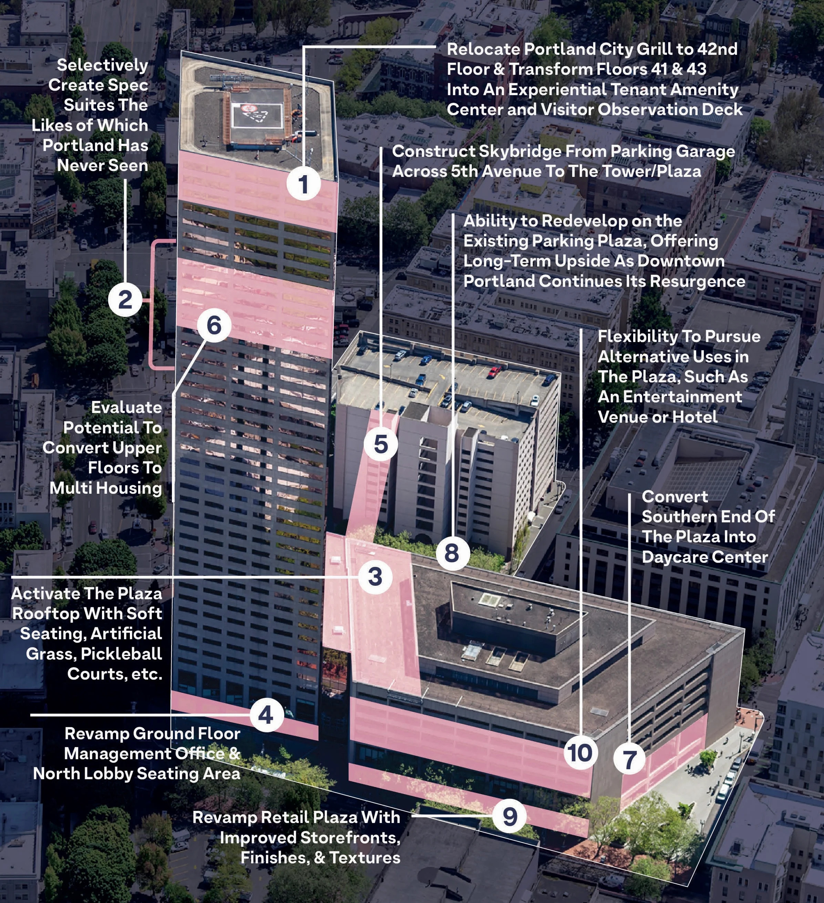
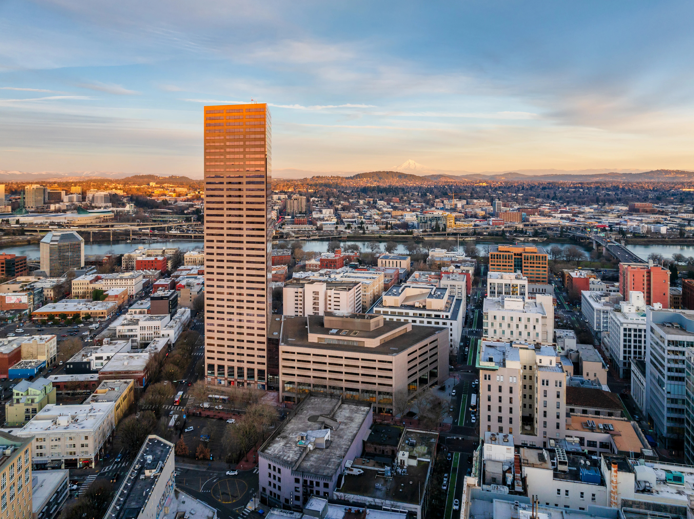

# U.S. Bancorp Tower

One of the Pacific Northwest's marquee office towers has landed a buyer within weeks of hitting the market as investment activity picks up across the nation, though valuations remain far below their pre-pandemic levels.

\
Global investment bank UBS closed a **$45M** deal to sell the U.S. Bancorp Tower&#x20;

* The Swickard Auto Group, a Las Vegas-based chain of car dealerships led by entrepreneur and private investor Jeff Swickard.&#x20;
* The auto magnate scooped up the "Big Pink" high-rise at 111 SW Fifth Ave. for just a fraction of the nearly $373 million it was valued at when a UBS affiliate acquired its stake in the nearly 1.2 million-square-foot building about half a decade ago (2015)

***

## Jeff Swickard

"This investment is about more than just real estate: It's about reaffirming our belief in Portland and what this city can become again," Swickard, a University of Oregon graduate, said in a statement. "I even interviewed for a job in the tower early in my career. To now become its owner is a full-circle moment, one that carries both meaning and responsibility."

Tenants handed back nearly 1 million square feet more than they signed on for over the past year[,](https://product.costar.com/Market/#/search/detail/submarket/USA/type/0/property/5/geography/259/slice/all) extending a yearslong occupancy-loss streak that has pushed downtown Portland's vacancy rate to a record high of roughly 28.5%.

The occupancy rate for the U.S. Bancorp Tower is hovering below 50%, but that figure could fall to about 25% after the firm's largest tenant, U.S. Bank, moves out of the building before the end of the year.

\
**Troubled history**

The all-cash deal closed earlier this month, the latest in a string of heavily discounted deals that have closed in recent years as property owners across the country become increasingly eager to get occupancy-challenged assets off their books.

Swickard said the purchase will help anchor his future real estate investment plans in and around the Portland area. Renovations and upgrades are already in the planning stages for the 1980s-era tower and its adjacent plaza, all of which will play into a strategy Swickard is developing to help reposition the struggling building ahead of what he's betting to be an imminent market turnaround.

The 42-story building has evolved through various chapters over the past few decades, most recently as a hub for tech companies such as New Relic and SurveyMonkey.

However, similar to other office towers in pandemic-pummeled markets, Big Pink faced a string of hefty move-outs and lease terminations in the earlier years of the pandemic. Prominent tenants including Fisher Phillips, Miller Nash and SurveyMonkey all vacated their spaces in the high-rise to relocate to newer and more amenitized properties elsewhere in the city.

Further compounding those struggles was U.S. Bank's decision last year not to renew the lease for its regional headquarters in the building that bears its name. The financial institution occupies more than 222,250 square feet across several floors that it plans to vacate before the end of this year.

### Willing to make the bet

The combination of depressed demand, stagnant leasing and the ongoing effects of flexible work has helped push the national office vacancy rate to a record high of nearly 14%, [according to CoStar data.](https://product.costar.com/Market/#/search/detail/national/USA/type/37/property/5/geography/1/slice/all) Tenants collectively handed back upward of 65 million square feet last year, boosting the total to more than 210 million square feet of move-outs since the start of 2020.

Those pandemic-induced factors have been exacerbated for a number of property owners, and some — especially if they're facing maturing loan deadlines or mounting expenses — have been eager to offload underperforming properties, even if it means closing a deal at a deep discount to their initial investments.

<mark style="background-color:green;">Smaller firms, such as those led by Swickard, continue to dominate the capital markets, though a growing sense of confidence in the long-term trajectory of the national office market is beginning to cajole larger investors into emerging from the pandemic-era sidelines.</mark>

Sales volume through the first quarter of the year more than doubled compared to the same period last year, according to CoStar's latest U.S. office report, "an early indication that investor activity is holding firm, even as broader questions about office demand, and the economy, persist."

To be clear, depressed office valuations are still the basis for the deeply discounted deals that buyers have been snapping up over the past couple of years. However, some firms have proved willing to pay a higher price tag for properties that offer all or some combination of newness, attractive amenities and solid tenant rosters with long-term deals in place, as well as desirable locations with quick access to transit options and retailers.

In Portland, smaller buyers are scooping up heavily discounted properties with a hold-and-wait approach that continues to dominate the city's investment scene. They've collectively closed about $133 million worth of deals in the downtown area over the past year, according to the data, just a slice of the roughly $440 million annual average reported in the years leading up to the pandemic.

***

On-Market

[JLL Investor Center](https://invest.jll.com/us/en/listings/office/u-s-bancorp-tower)

***

<figure><figcaption></figcaption></figure> <figure><figcaption></figcaption></figure>

***

**Rentable Area**

* 1,154,175 RSF
* 809,224 RSF (Tower) + 344,951 RSF (Plaza)

* **42 Stories**
* **45.7% Leased**
  &#x20;\- (23.7% Post-Known Vacates)

***



