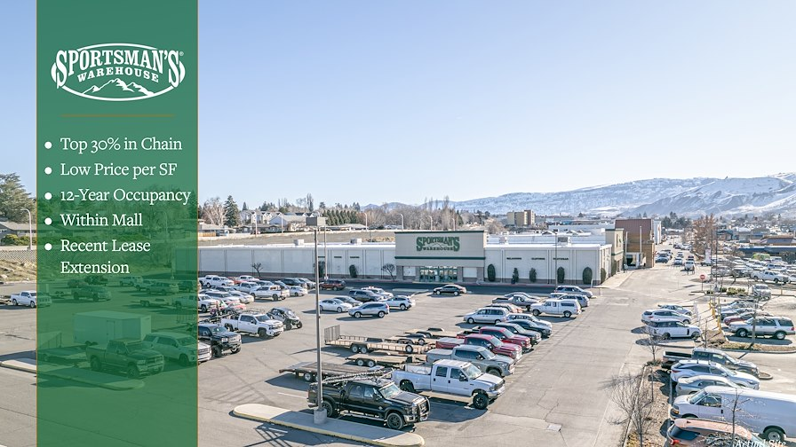
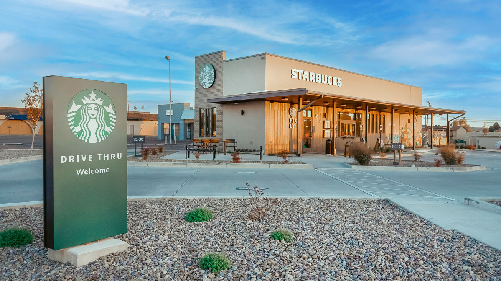
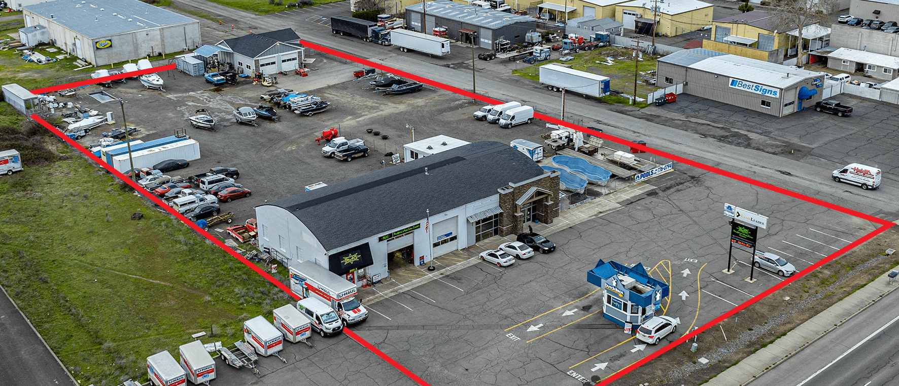

# 💵 Notable Listings Other


***

## 2025



<figure><figcaption><p><a href="https://www.crexi.com/properties/1931519/oregon-napa-auto-parts">Crexi</a></p></figcaption></figure>

<a href="file:///C:/Users/Admin/Documents/Other/GRIST/Tenant&#x27;s%20OCR/%F0%9F%9A%97%20Auto%20%F0%9F%9A%97/NAPA%20Auto%20Parts/(NAPA%20Auto%20Parts)%20760%20Ivy%20St,%20Junction%20City.pdf" class="button secondary">OM</a>

***

> **NAPA Auto Parts**
>
> 760 Ivy St, Junction City, OR 97448

* $1,077,000 (`$157/SF`)   |   6.25%  &#x20;
* 10-Year NNN Lease
* 2.5% Annual Increases
* 6,862 SF



5 Properties For Sale

<figure><figcaption><p><a href="https://product.costar.com/detail/lookup/5360865/shopping-center">CoStar</a>     |     <a href="https://www.crexi.com/properties/1828224/oregon-willamette-marketplace">Crexi</a></p></figcaption></figure>

***

* **RBA**: 63,078
* **Occupancy**: 91.4%

***

* The property is currently 91.4% leased with approximately 6.9 years of WALT offering investors stable in-place cash flow
* Willamette Marketplace is comprised of a three-story medical office building and four single-story retail buildings, providing natural synergy and excellent on-site amenities
* Willamette Marketplace offers investors a diverse income stream with over 55% of the NOI attributable to medical tenancy<br>



***

<figure><figcaption><p><a href="https://product.costar.com/detail/for-sale/default/5284037/summary/">CoStar</a>     |     <a href="https://www.crexi.com/properties/1792568/oregon-jaguar-land-rover-portland-or">Crexi</a></p></figcaption></figure>

> **Jaguar / Land Rover Dealership**
>
> 10131 SW Washington Square Rd, Tigard, OR 97223

* $12,385,000   |   6.25%
* Remaining Term 19.9 years   |   Exp 12/31/2044
* 62,000 SF  /  4.49 acres

***

* _**NNN Ground Lease:**_ Jaguar Land Rover’s NNN ground lease features ±20 years of term remaining with 7.5% rent increases every 5 years throughout the initial term and three 10-year renewal options.
* _**Residual Value of Improvements:**_ State-of-the-art showroom, three-story concrete parking structure and coveted zoning will provide investor ease of retenating.
* _**Excellent Access & Visibility:**_ Built in 2019, the 62,000-square-foot dealership building is positioned along Washington Square Road, feet from its intersection with SW Greenburg Road (11,297 VPD) and the on-ramp to SW Beaverton Tigard Freeway (107,854 VPD).
* _**Outparcel to the 1.3 MSF Washington Square Center**_

***

<figure><figcaption><p><a href="https://product.costar.com/detail/for-sale/default/5284013/summary">CoStar</a>     |     <a href="https://www.crexi.com/properties/1792551/oregon-thirsty-lion-gastropub-portland-or">Crexi</a></p></figcaption></figure>

> **Thirsty Lion Gastropub**
>
> 10205 SW Washington Square Rd, Portland, OR 97223

* $6,615,000   |   5.75%
* NN Lease (LL Roof & CAM Responsibility)
* Remaining Term 10.9 years     |     Exp 12/31/2035
* Rent Bumps 10% Every 5 Years Throughout Lease Term & Options

***

* _**Recently Extended Net Lease:**_ Previously set to expire in 2030, Thirsty Lion’s net lease was recently extended for an additional 5 years years through 2035 and now features ±10.9 years of term remaining with a 10% increase in 2031 and in each of the two 5-year renewal options.
* _**Original Location with Excellent Performance:**_ The subject property is the original Thirsty Lion Gastropub that fueled the concept’s expansion to multiple locations and has outperformed the average sales of other Thirsty Lion locations by more than $2 million in each of the last three years. Furthermore, this location has consistently maintained a rent-to-sales ratio below 5.0%.
* _**Excellent Access & Visibility:**_ The property is located with excellent access and visibility on a hard corner at the signalized intersection of SW Washington Square Road and SW Greenburg Road (11,297 VPD), and is feet from the on-ramp to SW Beaverton Tigard Freeway (107,854 VPD)
* _**Outparcel to the 1.3 MSF Washington Square Center:**_ Thirsty Lion is an outparcel to the 1.3 MSF Washington Square retail center, which is Oregon’s premier shopping destination featuring over 170 stores and a 356-room Embassy Suites hotel.&#x20;

***

[Bank of America](https://product.costar.com/detail/for-sale/default/5283999/summary/)



> **Johnson Creek Crossing**
>
> `9600 SE 82nd Ave, Portland, OR 97086`

```
https://ahprd1cdn.csgpimgs.com/d2/wSz4rg15jtijugb0iwNe_sSevN_Z1Bn-h8nM1NpZp6E/Johnson%20Creek%20Crossing_Brochure%20-%209600%20SE%2082nd%20Ave.pdf

file:///C:/Users/Admin/Downloads/(Johnson%20Creek%20Crossing)%209600%20SE%2082nd%20Ave,%20Portland.pdf
```

***

<figure><figcaption><p><a href="https://product.costar.com/detail/all-properties/5623577/shopping-center">CoStar</a></p></figcaption></figure>

***

* NOI:  $3,339,396
* 19.61 acres
* Johnson Creek Crossing is a ten-building shopping complex in the southeast Portland area. Located conveniently off the interchange of I-205 at Johnson Creek Boulevard and 82nd Avenue, the property includes a Best Buy, Dania, PetSmart, and multiple restaurants and services.

***

**Attractive Anchor Rents**

* Dania: $9.42/SF
* Best Buy: $14.32/SF
* HomeGoods: $15.00/SF
* Burlington: $16.50/SF
* PetSmart: $20.84/SF

**Seasoned Tenancy**

63% of the tenants have operated at the Center for over 10 years.

> 20+ years: Best Buy, PetSmart, Starbucks, Wells Fargo, Burger King, Supercuts, Bell Nails & Spa, Arawan Thai Cuisine, and Suns Up Tanning

Placer Data

| Tenant               | OR - Rank # | National |
| -------------------- | ----------- | -------- |
| Home Depot           | 3           | Top 12%  |
| PetSmart             | 2           | Top 2%   |
| Best Buy             | 4           | Top 18%  |
| Burlington           | 1           | Top 14%  |
| HomeGoods            | 5           | Top 35%  |
| Supercuts            | 3           | Top 16%  |
| Wells Fargo          | 3           | Top 15%  |
| ATI Physical Therapy | 1           | Top 10%  |





> **Sportsman's Warehouse**
>
> `611 Valley Mall Pkwy, East Wenatchee, WA 98802`

<mark style="background-color:green;">$2,988,514</mark>  -  ($64/SF)   |   <mark style="background-color:green;">7.00%</mark>

```
file:///C:/Users/Admin/Documents/Other/GRIST/Tenant's%20OCR/%F0%9F%93%A6%20Big%20Box%20%F0%9F%93%A6/(Sportsman's%20Warehouse)%20611%20Valley%20Mall%20Pkwy,%20East%20Wenatchee,%20WA.pdf
```

***

<figure><figcaption><p><a href="https://www.mymnet.com/activity/ZAG0090034">M-Net</a></p></figcaption></figure>

***

* Top 30% in Chain per Placer   |   Low Price per SF   |   12 Year Historical Occupancy
* Located w/in Wenatchee Valley Mall - the Largest Mall in Wenatchee
* Multiple Points of Ingress/Egress   |   High Density Retail Corridor

***

* Expiration Date:  `March 31, 2033`
* Year:  2000 | 2017 (New Roof)
* Increases 5% Every 5 Years



<figure><figcaption><p><a href="https://product.costar.com/detail/lookup/10066458/summary">CoStar</a>    |    <a href="https://www.crexi.com/properties/1773831/oregon-corporate-guaranteed-nnn-investment-property">Crexi</a></p></figcaption></figure>

***

**Cadence Academy**

`334 SE 146th Ave, Portland, OR 97233`

```
file:///C:/Users/Admin/Documents/Other/GRIST/Tenant's%20OCR/Schools/Cadence%20Academy/(Cadence%20Academy)%20334%20SE%20146th%20Ave,%20Portland%20(New).pdf
```

***

* $799,000    |    6.50%

***

* Corporate Guarantee - Absolute Net
* RBA: 2,118
* **Term**   `5 years left with options to renew`
* **Options** `2 remaining options to renew for 5 years each`
* **Increases**    `2% yearly increase in rent`

***

**Previous Sale**

* Nov 29, 2021  |  $789,000  |  6.50%
* On Market 266 Days
* Original Ask Price of $825,000

| Cashflow | Rent            |
| -------- | --------------- |
| 2022     | $70,683.94      |
| 2023     | $52,995.88      |
| 2024     | $54,055.80      |
|          | **$177,735.62** |




***

## 2024


{% tab title="Starbucks - NM (6+%)" %}
<figure><figcaption><p><a href="https://www.crexi.com/properties/1751744/new-mexico-starbucks-investment-opportunity">Crexi</a></p></figcaption></figure>

***

## Starbucks

`505 E 20th St, Farmington, NM 87401`

```
file:///C:/Users/Admin/Documents/Other/GRIST/Tenant's%20OCR/%E2%98%95%20Coffee/Starbucks/(Starbucks)%20505%20E%2020th%20St,%20Farmington,%20NM%20(6.15%25).pdf
```

***

* `$2,455,415`   |   `6.15%`
* **Lease Expiration**: `07/30/2034`
* **Year Built**: `2024`
* NN Lease

***



<figure><figcaption><p>The Eliot Tower</p></figcaption></figure>

`Constructed in 2006, the Eliot Tower stands as an 18-story modern condominium high-rise that integrates retail and residential uses, featuring street-level retail complemented by 223 condominium homes above.`

***

## The Eliot Tower

`1221 SW 10th Ave, Portland, OR 97205`              [Crexi](https://www.crexi.com/properties/1734980/oregon-the-eliot-tower)     |     [CoStar](https://product.costar.com/detail/lookup/1517877/summary)

***

* **Price**: $2,150,000 | **Price**/SF: $271
* **Cap Rate**: 7.50%
* **Occupancy**: 81.25%
* **RBA**: 7,897

***

## Rent Roll

<figure><figcaption></figcaption></figure>

***

## Features:

* **NNN Leases:** Triple net leases in place, ensuring reimbursement of building expenses such as taxes, insurance, and maintenance
* **Established Tenants:** Features long-term tenants with proven track records, enhancing stability and reliability
* **Mixed-Use Building:** Strategically designed to generate consistent foot traffic through diverse retail and residential spaces



<figure><figcaption></figcaption></figure>

`3811 Crater Lake Hwy, Medford, OR 97504`   |   [CoStar](https://product.costar.com/detail/all-properties/8924045/summary)

"Third, and directly fronting Crater Lake Hwy, is a ± 132 SF Dutch Bros drive-through coffee stand on a **ground lease**."

* Annual Gross Rental property income is $162,727.50.

***

For-Sale by Owner 11/04 (118 Days)      |      147 Days On Market (12/04)

* $2,000,000  |  (7.20%)

***

* Main Structure - `6,469 SF with 2 distinct units`
* Second structure - `2,318 SF shop`
* **UNIT ONE** - `real estate office, that is also owned by the seller of the property. So seller/Lessee of Real Estate Office space is flexible on continued leaseback or terms to move out`
* **UNIT TWO** - `leased to an automotive shop, with about 30% office space`
* Dutch Bros - `132 SF, ground lease`

***

* The owner of the 2,318 SF building is the seller's Brother, is flexible and qualified to consider cooperation in dividing the property to purchase the back portion, or consider a longer-term leaseback, or to vacate upon lease term, depending on a buyer intended reason of purchase. NOTE: The ± 2,318 SF shop and building income of $36K per year are included at listed price and NOI.



<figure><figcaption></figcaption></figure>

`16550-16690 SE McLoughlin Blvd, Milwaukie, OR 97267`

[Crexi](https://www.crexi.com/properties/1726225/oregon-vineyard-plaza)   |   [CoStar](https://product.costar.com/detail/all-properties/4223254/summary)

```
file:///C:/Users/Admin/Documents/Other/GRIST/Tenant's%20OCR/Centers-Plaza/Vineyard%20Plaza/(Vineyard%20Plaza)%2016550-16690%20SE%20McLoughlin%20Blvd,%20Milwaukie.pdf
```

***

## Price Drop (02/04)

* $5,000,000   |   5.87%
* $158.41

***

* **Price:** $7,300,000
* **Price/SF:** $235.17
* **RBA:** 31,041
* **Land:** 258,311 SF  /  5.93 AC

***

**Highlights**

* **Building 1:** Round Table Pizza with 5,464 SF&#x20;
* **Building 2:** Has 17,700 SF with 3 larger & 3 smaller tenants&#x20;
* **Building 3:** Has 8,400 SF with 5 tenants

12-Unit strip mall with long-term established tenants

3 building mall with monument sign and 2 ingress/egress




