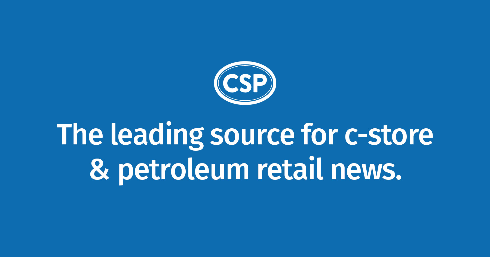

---
layout:
  width: default
  title:
    visible: true
  description:
    visible: false
  tableOfContents:
    visible: true
  outline:
    visible: true
  pagination:
    visible: true
  metadata:
    visible: true
  tags:
    visible: true
  actions:
    visible: true
  anchors:
    visible: true
---

# 📆 Calender  |  Routine

## <mark style="background-color:green;">Monthly</mark>

<table data-view="cards" data-full-width="true"><thead><tr><th align="center"></th><th data-hidden data-card-target data-type="content-ref"></th><th data-hidden data-card-cover data-type="files"></th></tr></thead><tbody><tr><td align="center"><strong>📊 Shopping Center - Market Insights</strong></td><td><a href="https://shoppingcenters.com/article/shopping-center-retail-location-insights">https://shoppingcenters.com/article/shopping-center-retail-location-insights</a></td><td><a href="../../.gitbook/assets/Tenant-Mix-and-Retail-Chain-Metrics-v-1252024-1.webp">Tenant-Mix-and-Retail-Chain-Metrics-v-1252024-1.webp</a></td></tr><tr><td align="center"><strong>Trade Net Lease</strong></td><td><a href="../retail/b-and-e-trade-net-lease.md">b-and-e-trade-net-lease.md</a></td><td><a href="../../.gitbook/assets/Q2-Cap-Rate-Report.png">Q2-Cap-Rate-Report.png</a></td></tr><tr><td align="center"></td><td></td><td></td></tr></tbody></table>

<table data-full-width="true"><thead><tr><th width="293">Name</th><th width="575">Note</th><th>Interval<select multiple><option value="J26J46YtSQNc" label="Weekly" color="blue"></option><option value="HDZabEXFyymp" label="Monthly" color="blue"></option><option value="fLZzpgcZbugb" label="Quarterly" color="blue"></option></select></th></tr></thead><tbody><tr><td><a href="https://francemediainc.com/commercial-real-estate-magazines/"><strong>Shopping Center Business</strong></a></td><td>Commercial Real Estate <a href="https://francemediainc.com/commercial-real-estate-magazines/">Magazines</a></td><td>Monthly</td></tr><tr><td><a href="https://retailrestaurantfb.com/"><strong>Retail &#x26; Restaurant</strong></a></td><td></td><td></td></tr><tr><td>PNC</td><td><a href="https://www.pnc.com/content/dam/pnc-com/pdf/corporateandinstitutional/topics/food-and-beverage/fb-monthly-news-brief-november-2024.pdf">Food &#x26; Beverage - Monthly News Brief</a></td><td>Monthly</td></tr><tr><td><code>PNC’s</code>  <a href="https://www.pnc.com/insights/corporate-institutional/gain-market-insight/weekly-market-watch.html?lnksrc=pnc-insights-feed"><strong>Weekly Market Watch</strong></a></td><td><code>Weekly Market Watch</code></td><td>Weekly</td></tr><tr><td>PNC</td><td><a href="https://www.pnc.com/insights/corporate-institutional.html">Corporate &#x26; Institutional - Insights</a></td><td>Weekly</td></tr><tr><td>PNC - FinTech</td><td><a href="https://www.pnc.com/en/corporate-and-institutional/topics/specialty-segments/fintech.html">Quarterly Newsletter</a>  <code>Stay Current on Industry Trends</code></td><td>Quarterly</td></tr><tr><td>Chain Storage</td><td><a href="https://chainstoreage.com/digital-editions">Digital Editions</a> - <code>Every 2 Months</code></td><td>Quarterly</td></tr><tr><td>Super Market News</td><td>Digital Edition - Supermarket News</td><td>Monthly</td></tr><tr><td>Nation's Restaurant News</td><td><a href="https://www.nrn.com/digital-edition">Digital Edition</a> - Monthly</td><td>Monthly</td></tr><tr><td>Restaurant Business</td><td><a href="https://www.restaurantbusinessonline.com/magazine">Magazine</a> - Monthly or Every-Other Month</td><td>Monthly</td></tr><tr><td>Northmarq</td><td>Tenant Expansion Trends - <a href="https://www.northmarq.com/insights/research/top-100-tenant-expansion-trends">Quarterly Report</a></td><td>Quarterly</td></tr><tr><td>Northmarq</td><td><a href="https://www.northmarq.com/trends-insights/research-library/marketsnapshot">Market Snapshot</a> - Quarterly Reports</td><td>Quarterly</td></tr></tbody></table>

***

<table data-view="cards" data-full-width="true"><thead><tr><th align="center"></th><th data-type="files"></th><th data-hidden data-card-target data-type="content-ref"></th><th data-hidden data-card-cover data-type="files"></th></tr></thead><tbody><tr><td align="center"></td><td></td><td><a href="shopping-center-business.md">shopping-center-business.md</a></td><td></td></tr><tr><td align="center"></td><td></td><td><a href="retail-and-restaurant.md">retail-and-restaurant.md</a></td><td></td></tr><tr><td align="center"></td><td></td><td><a href="traded.md">traded.md</a></td><td></td></tr><tr><td align="center"></td><td></td><td><a href="shoppingcenters.com.md">shoppingcenters.com.md</a></td><td></td></tr><tr><td align="center"></td><td></td><td><a href="super-market-news.md">super-market-news.md</a></td><td></td></tr><tr><td align="center"></td><td></td><td><a href="chain-storage.md">chain-storage.md</a></td><td></td></tr><tr><td align="center"></td><td></td><td><a href="nations-restaurant-news.md">nations-restaurant-news.md</a></td><td></td></tr><tr><td align="center"></td><td></td><td><a href="csp.md">csp.md</a></td><td></td></tr><tr><td align="center"></td><td></td><td><a href="restaurant-business.md">restaurant-business.md</a></td><td></td></tr><tr><td align="center"></td><td></td><td><a href="the-shelby-report.md">the-shelby-report.md</a></td><td></td></tr></tbody></table>

***

## To be Added

* [https://www.franchisetimes.com/](https://www.franchisetimes.com/)
* [Grocery Dive](https://www.grocerydive.com/news/aldi-plans-to-open-120-stores-in-2023/649115/)
* [The Retail TouchPoints Network](https://www.retailtouchpoints.com/features/news-briefs/dicks-doubles-down-on-house-of-sport-format-planning-19-new-locations-by-2024)
* [https://www.retailtouchpoints.com/](https://www.retailtouchpoints.com/)
* [https://www.retailindustryguide.com/](https://www.retailindustryguide.com/)
* [https://www.retailwatchers.com/index.php](https://www.retailwatchers.com/index.php)

### [Restaurant Finance Monitor](https://www.restfinance.com/)

* The Monitor’s monthly newsletter keeps restaurant owners, lenders, landlords, brokers and investors informed of the financial and investment trends impacting the restaurant industry. It’s professionally-written, an inside-the-ropes expert on the multi-unit restaurant business. 

***

## 🔄 Routine | Calls 🔄

1. Constant Calls
2. Follow Ups
3. X - Properties      |      `Loop-Thru`
