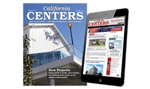

# 📰 Shopping Center Business


Newsletter & Monthly


.gif>)

<a href="https://francemediainc.com/publications/">Magazines</a> &#x26; Newsletters

### Shopping Center Business

* Print magazine, website & weekly e-newsletter
* The only business magazine for the shopping center industry. Shopping Center Business focuses on company profiles, in-depth articles of current industry topics, and activity reports from different geographic areas of the U.S. and abroad.
* [Click here ](http://www.shoppingcenterbusiness.com/)for more info.

***

### California Centers

* Print magazine & weekly e-newsletter
* Serves retailers, developers, shopping center owners, investment sales brokers and tenant representation firms throughout the state of California
* [Click here ](http://www.californiacenters.com/)for more info.

***

### Western Real Estate Business

* Print magazine & twice-weekly e-newsletter
* Covering Arizona, California, Colorado, Hawaii, Nevada, New Mexico, Utah, Idaho, Oregon and Washington.
* Developments, sales, leases, lending activity & trends in the multifamily, retail, office, healthcare, industrial and hospitality sectors
* [Click here ](http://rebusinessonline.com/magazines/western-real-estate-business/)for more info

***

### REBusinessOnline.com

* Website & daily e-newsletter
* Daily updates covering developments, sales, leases, lending activity & trends in the multifamily, retail, office, healthcare, industrial and hospitality sectors nationwide
* News is organized and easily searched by region and by property type.
* [Click here ](http://rebusinessonline.com/)to visit the website

***

### Retail & Restaurant Facility Business

* Print magazine and weekly e-newsletter
* Covering retail and restaurant facilities & maintenance issues nationwide
* Management, operations, construction & design, sustainability, vendor news, and products
* [Click here ](http://retailrestaurantfb.com/)for more info

***

## News

* [Oregon](https://shoppingcenterbusiness.com/category/oregon)   |   [Retailers](https://shoppingcenterbusiness.com/category/retailers/)   |   [Restaurants](https://shoppingcenterbusiness.com/category/restaurant/)   |   [Development](https://shoppingcenterbusiness.com/category/development/)
* [Investment sales](https://shoppingcenterbusiness.com/category/investment-sales/)   |   [Finance](https://shoppingcenterbusiness.com/category/finance/)   |   [Leasing](https://shoppingcenterbusiness.com/category/leases/)   |   [Operations](https://shoppingcenterbusiness.com/category/operations/)   |   [Company news](https://shoppingcenterbusiness.com/category/company-news/)

***

[**Retail Insight**](https://shoppingcenterbusiness.com/category/retail-insight/)   **|**   [**Industry Content**](https://shoppingcenterbusiness.com/category/industry-content/)

_Shopping Center Business_ magazine is the leading publication for the shopping center industry. The [<mark style="background-color:green;">monthly magazine</mark>](https://francemediainc.com/commercial-real-estate-magazines/) brings readers the latest news and cutting-edge features.

Our editorial philosophy does not revolve around a calendar of monthly product promotions or features. Instead, we report on what the industry needs each month: in-depth news and articles on the latest events and trends in the retail industry.

If you own, develop, design, lease, operate, finance or occupy retail space, _Shopping Center Business_ is the news source you need.

The magazine is published 12 times per year, and the _Shopping Center Business_ <mark style="background-color:green;">weekly newsletter</mark> delivers the industry’s latest headlines to your inbox every Wednesday.

***

Other

**Sector-Specific Publications**

* We cover the retail industry with _Shopping Center Business_ magazine, on [www.shoppingcenterbusiness.com](http://www.shoppingcenterbusiness.com/) and a [weekly e-newsletter](http://www.francemediainc.com/all-newsletters).
* We cover retail real estate in California with [California Centers magazine](https://www.californiacenters.com/) and a weekly [e-newsletter](https://www.californiacenters.com/).

**Commercial Real Estate Publications by Region**

* [REBusinessOnline.com](http://www.rebusinessonline.com/) is a national website covering all aspects of the commercial real estate industry; [sign up for the daily e-newsletter](http://www.francemediainc.com/all-newsletters).
* Regional print magazines include [_Heartland Real Estate Business_](http://rebusinessonline.com/magazines/heartland-real-estate-business/)_,_ [_Northeast Real Estate Business_](http://rebusinessonline.com/magazines/northeast-real-estate-business/)_,_ [_Southeast Real Estate Business_](http://rebusinessonline.com/magazines/southeast-real-estate-business/)_,_ [_Texas Real Estate Business_](http://rebusinessonline.com/magazines/texas-real-estate-business/) and [_Western Real Estate Business_](http://rebusinessonline.com/magazines/western-real-estate-business/). These publications cover all sectors of commercial real estate within their respective geographic areas. [Sign up for the twice-weekly e-newsletter for each region](http://www.francemediainc.com/online.html).

**Facilities Management**

We cover retail and restaurant facilities and operations maintenance issues in _Retail & Restaurant Facility Business_ magazine, as well as online at [www.retailrestaurantfb.com](http://www.retailrestaurantfb.com/) websites and in the [weekly e-newsletter](http://www.francemediainc.com/all-newsletters).

