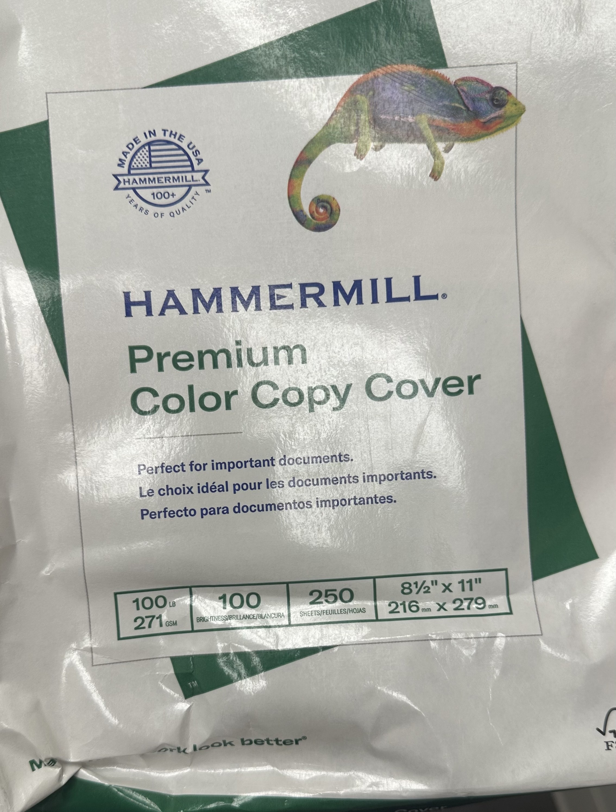

# 🖨️ Postcards

Dairy Queen Postcard:

## **Print**

* **Paper source**: Multi-purpose
* **Media type**: Heavy 5
* Shrink to fit printable area
* (**layout > scale**: scale to fit)



`11' x 17'` or `8.5' x 11'` Cardstock


<details>

<summary>Paper</summary>

<figure><figcaption><p><strong>Heavy #5</strong></p></figcaption></figure>

</details>

<details>

<summary>Mailer Stamp Placement</summary>

5.5 cm Length
\
4 cm Width


<figure><figcaption></figcaption></figure>


</details>

***


```
F:\Marcus & Millichap\Postcard\marketingcampaigns

C:\Users\Admin\Desktop\Dynamic HTML\HTML-Project\Applebee's Market Analysis\Del Tondo - Dairy Queen\Postcard
```
